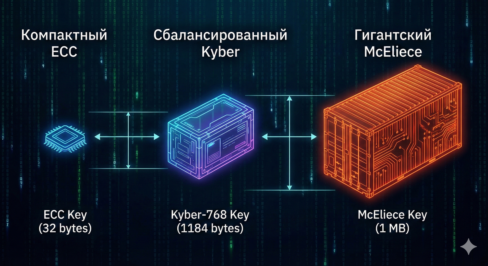

# Статья

Status: Not started
Sprint: Sprint 6 (https://www.notion.so/Sprint-6-275ddf7c60ba81359829d865557017e4?pvs=21)
Ready\Waiting: Ready to start
For: Сегодня

# Квантовый апокалипсис отменяется: Инженерный гайд по переходу на Post-Quantum Cryptography (PQC)

## Об этом уроке

В 2024 году криптография пережила тектонический сдвиг, сравнимый с появлением SSL в 90-х. Национальный институт стандартов и технологий США (NIST) завершил многолетнюю «Олимпиаду алгоритмов» и утвердил стандарты защиты от квантовых компьютеров.

Это руководство написано для **инженеров, архитекторов и DevOps-специалистов**, которым предстоит внедрять эти изменения в реальные системы. Мы не будем углубляться в сложную квантовую механику, а сосредоточимся на том, как это влияет на ваш код, трафик и инфраструктуру.

**Из этого урока вы узнаете:**

- **Почему ваши данные в опасности уже сегодня**, хотя мощный квантовый компьютер еще не построен (стратегия *«Harvest Now, Decrypt Later»*).
- **Разбор стандартов NIST:** В чем разница между ML-KEM (Kyber), ML-DSA (Dilithium) и SLH-DSA (SPHINCS+), и какой из них выбрать для вашего микросервиса.
- **Инженерные «грабли»:** Как новые «тяжелые» ключи ломают TCP-пакеты, вызывают фрагментацию и заставляют перенастраивать фаерволы (проблема MTU и Ossification).
- **Почему AES-256 выживет:** Как алгоритмы Гровера и Шора влияют на симметричное и асимметричное шифрование.
- **Гибридная защита:** Как внедрить PQC прямо сейчас, не ломая совместимость со старыми клиентами (паттерн *X25519 + Kyber*).

Этот материал — ваш мост из мира классической криптографии (RSA/ECC) в эпоху пост-квантовой защиты.

## Введение: Y2Q уже здесь

Вы наверняка слышали о «Проблеме 2000 года» (Y2K). Тогда весь мир в панике переписывал код, чтобы компьютеры не сошли с ума при смене даты. Сегодня индустрия безопасности готовится к событию, которое получило название **Y2Q (Years to Quantum)** — моменту, когда квантовый компьютер сможет взломать современную криптографию.

Долгое время Y2Q был страшилкой из области научной фантастики. Физики говорили: «Возможно, через 30 лет». Бизнес отвечал: «Тогда и подумаем».

### Точка невозврата: Август 2024

Все изменилось 13 августа 2024 года. NIST официально опубликовал финальные версии стандартов пост-квантовой криптографии (FIPS 203, 204, 205).

Это событие перевело PQC (Post-Quantum Cryptography) из разряда *«научных экспериментов»* в разряд *«обязательных требований compliance»*.

- **Apple** уже внедрила PQC в iMessage (протокол PQ3).
- **Google** включил гибридный обмен ключами в Chrome и на своих серверах.
- **Signal** перешел на протокол PQXDH.

### Почему это касается вас?

Если вы думаете, что это касается только банков и военных, вы ошибаетесь. Миграция на PQC — это не просто смена библиотеки. Это изменение размера ключей в 10–100 раз, изменение времени рукопожатия (handshake) и новые требования к сети.

Если ваш бэкенд использует жестко прописанные параметры TLS, старые VPN-шлюзы или IoT-устройства с ограниченной памятью — **наступление эры PQC может просто «положить» ваш сервис**, даже если никто не будет его атаковать.

> **Главный тезис:** Переход на пост-квантовую криптографию — это сложная инженерная задача по миграции инфраструктуры, которую нужно начинать решать задолго до того, как первый квантовый компьютер реально заработает.
>

## Угроза из будущего или реальность 2025 года?

Многие разработчики воспринимают "Квантовый апокалипсис" как проблему 2000-го года (Y2K) — много шума, а по факту ничего не произошло. Однако в 2025 году ситуация кардинально изменилась. Мы перешли от теоретической физики к инженерной гонке.

Чтобы понять, почему ваш текущий стек безопасности (TLS 1.2/1.3 с RSA/ECDH) устарел уже сегодня, нужно разобраться в трех вещах: состоянии железа, разнице между физическими и логическими кубитами, и экономической стратегии атакующих.

### Железо есть, взлома нет: Парадокс NISQ и CRQC

В новостях вы видите заголовки: «Google представил процессор на 100+ кубитов». Если для взлома RSA нужно около 4000 кубитов, почему интернет еще не рухнул?

Ответ в качестве кубитов.

### Эпоха NISQ (Noisy Intermediate-Scale Quantum)

Cегодня мы живем в эпоху "шумных" квантовых компьютеров.

- **Google Willow:** В конце 2024 — начале 2025 года Google продемонстрировала чип Willow (105 кубитов). Его главная сила не в количестве кубитов, а в том, что инженерам впервые удалось снизить количество ошибок при масштабировании.
- **IBM Heron:** IBM перешла к промышленному производству процессоров, нацеленных на создание модульных систем.

Основная проблема в том, что эти **физические кубиты** нестабильны. Они теряют состояние (декогеренция) за микросекунды.

### CRQC (Cryptographically Relevant Quantum Computer)

Для взлома криптографии нужен **CRQC** — криптографически значимый компьютер. Он оперирует **логическими кубитами**.
Один *логический* кубит — это сложная конструкция из сотен или тысяч *физических* кубитов, которые занимаются коррекцией ошибок друг друга.

> **Инсайт 2025 года:** Ранее считалось, что для взлома RSA-2048 нужно 20 миллионов физических кубитов. Однако оптимизация алгоритма Шора (так называемая "Gidney Optimization", опубликованная в мае 2025) показала, что при достаточной точности железа планку можно снизить до <1 миллиона физических кубитов.
>

Это сдвинуло прогноз появления CRQC с "никогда" или "2050 года" на примерное начало 2030-х.


### Концепция "Harvest Now, Decrypt Later" (HNDL)

Если квантового компьютера, способного взломать RSA, еще нет, зачем суетиться сейчас? Потому что ваши данные уже собирают.

Атака **HNDL** (Собирай сейчас, расшифровывай потом) — это стратегия, которую используют спецслужбы и крупные хакерские группировки.

1. **Harvest (Сбор):** Злоумышленник записывает весь зашифрованный трафик (дампы TLS-сессий, VPN-туннелей), проходящий через подконтрольные узлы интернета. Сейчас этот трафик выглядит как мусор — алгоритмы AES-256 и RSA-2048 надежно его защищают.
2. **Store (Хранение):** Терабайты данных складываются в холодные хранилища (дата-центры) на 5–10 лет. Стоимость хранения данных в 2025 году мала.
3. **Decrypt (Расшифровка):** Как только в 2030–2032 году появится первый CRQC, он не будет "ломать" весь интернет в реальном времени, вместо этого он начнет "перемалывать" накопленные архивы.

**Что под угрозой?**

- **Не важно:** Ваш пароль от соцсети (вы его смените 100 раз).
- **Критично:** Банковские транзакции, медицинские карты (геномные данные не меняются), государственные тайны, промышленные секреты, ключи от IoT-устройств с долгим сроком службы (автомобили, спутники).

Если вы передаете данные, которые должны оставаться секретными более 5 лет, вы **уже** уязвимы.

### Теорема Моска: Математика неизбежности

Микеле Моска (Michele Mosca), один из пионеров пост-квантовой криптографии, формализовал этот риск простым неравенством. Оно помогает понять, когда именно вашему проекту нужно начинать миграцию.

Неравенство Моска:

`$$X + Y > Z$$`

Где:

- **X (Shelf Life):** Срок жизни ваших данных. Сколько лет информация должна оставаться секретной?
- **Y (Migration Time):** Время на миграцию. Сколько лет нужно вашей компании, чтобы обновить все системы, библиотеки, протоколы и "железо" на пост-квантовые стандарты? (Спойлер: это всегда дольше, чем вы думаете).
- **Z (Collapse Time):** Время до появления мощного квантового компьютера (CRQC).

**Интерпретация:**
Если сумма времени хранения данных и времени на миграцию превышает время до создания квантового компьютера, **вы уже опоздали**.

### Практическое задание: Оценка рисков

Давайте напишем простой скрипт на Python, который поможет вам оценить риски для вашего проекта, основываясь на текущих прогнозах индустрии (Z ≈ 7-10 лет).

```python
import datetime
from typing import Tuple

def check_quantum_risk(data_type: str, shelf_life_years: int, migration_estimate_years: int) -> Tuple[bool, int]:
    """
    Оценка риска по теореме Моска.

    :return: (is_safe, gap_years) — is_safe=True если безопасно, gap_years=разница в годах.

    :param data_type: Тип данных (строка)
    :param shelf_life_years: X - сколько лет данные должны быть секретны
    :param migration_estimate_years: Y - сколько лет займет внедрение PQC
    """
    # YEAR_CRQC_ARRIVAL — прогнозный год появления CRQC (пример: 2032).
    # В учебном примере оставляем константу; в реальном коде стоит вынести это как параметр/конфиг.
    YEAR_CRQC_ARRIVAL = 2032

    # current_year — динамически получаемый год, чтобы пример оставался актуальным
    current_year = datetime.date.today().year

    # time_to_collapse_z — оставшееся время до CRQC (Z в неравенстве Моска)
    time_to_collapse_z = YEAR_CRQC_ARRIVAL - current_year

    # total_exposure = X + Y — суммарная экспозиция (лет), которую нужно сравнить с Z
    total_exposure = shelf_life_years + migration_estimate_years

    print(f"--- Анализ для: {data_type} ---")
    print(f"Срок жизни данных (X): {shelf_life_years} лет")
    print(f"Время на миграцию (Y): {migration_estimate_years} лет")
    print(f"Время до Квантового Компьютера (Z): {time_to_collapse_z} лет")

    if total_exposure > time_to_collapse_z:
        risk_gap = total_exposure - time_to_collapse_z
        print(f"🔴 КРИТИЧЕСКИЙ РИСК! Вы опоздали на {risk_gap} лет.")
        print("Данные, зашифрованные сегодня классическими методами, будут расшифрованы до истечения их срока секретности.")
        print("РЕКОМЕНДАЦИЯ: Немедленно внедрять гибридное шифрование (Hybrid Key Exchange).\\n")
        return False, risk_gap
    else:
        safety_margin = time_to_collapse_z - total_exposure
        print(f"🟢 Безопасно. Запас времени: {safety_margin} лет.")
        print("РЕКОМЕНДАЦИЯ: Планировать миграцию в штатном режиме.\\n")
        return True, safety_margin

if __name__ == "__main__":
    # Примеры использования:
    # 1. Веб-сессии, токены доступа (живут минуты или дни)
    check_quantum_risk("Session Tokens", shelf_life_years=0, migration_estimate_years=3)

    # 2. Медицинские данные или Коммерческая тайна (живут десятилетиями)
    # Миграция в энтерпрайзе долгая (до 5 лет)
    check_quantum_risk("Genomic Data / Trade Secrets", shelf_life_years=15, migration_estimate_years=5)
```

**Вывод:** Для долгоживущих данных угроза не в будущем. Она существует сейчас, просто результат атаки отложен во времени. Именно поэтому переход на PQC (Post-Quantum Cryptography) — это не задача "на потом", а необходимость сегодняшнего дня.

## «Смерть классики: Шор против RSA и Гровер против AES»

Чтобы понять, почему нам нужно менять фундамент безопасности интернета, нужно разобраться, *как именно* он ломает математику, на которой мы строили защиту последние 40 лет.

В криптографии есть два главных "монстра": алгоритм Шора (убивает асимметрию) и алгоритм Гровера (ослабляет симметрию).

### Асимметрия под ударом: Почему ECC падет первым

Вся современная асимметричная криптография (PKI) держится на так называемых **функциях с потайным входом (trapdoor functions)**. Это математические задачи, которые легко решить в одну сторону, но вычислительно невозможно в обратную — если не знать секрет.

1. **RSA** полагается на сложность **факторизации больших целых чисел**. (Легко умножить два простых числа `$P \times Q$`, невозможно быстро найти `$P$` и `$Q$`, зная только результат).
2. **ECC (Эллиптические кривые)** и **DH (Диффи-Хеллман)** полагаются на сложность **дискретного логарифмирования**. (Легко скакать по точкам кривой, зная множитель, невозможно узнать множитель, зная конечную точку).

### Алгоритм Шора (Shor's Algorithm)

Питер Шор в 1994 году доказал, что квантовый компьютер может использовать явление квантовой суперпозиции, чтобы найти **период функции**. А нахождение периода функции позволяет превратить задачу факторизации и дискретного логарифмирования из экспоненциально сложной в полиномиальную.

Грубо говоря, классический компьютер перебирает ключи как слепой, тыкающийся в стены лабиринта. Алгоритм Шора позволяет "взлететь" над лабиринтом и увидеть выход.

### Парадокс ECC: Эффективность становится уязвимостью

Мы привыкли считать, что **ECC безопаснее RSA**. Ключ ECC-256 обеспечивает ту же защиту, что и RSA-3072, но работает быстрее и занимает меньше места.

Однако в квантовом мире эта логика переворачивается.
Алгоритм Шора требует количества кубитов, пропорционального длине ключа.

- Чтобы взломать **RSA-2048**, нужно примерно **4098** идеальных логических кубитов.
- Чтобы взломать **ECDSA-256**, нужно всего около **2330** логических кубитов.

**Инсайт:** Из-за того, что ключи ECC короче, квантовому компьютеру *проще* с ними работать. Эллиптические кривые, вероятно, падут первыми, задолго до того, как у атакующих хватит мощности на взлом старого доброго RSA-2048.


### Симметрия держит удар

Симметричное шифрование (AES, ChaCha20) и хеш-функции (SHA-2, SHA-3) не имеют скрытой математической структуры, такой как периодичность. Они "перемалывают" биты хаотично. Алгоритм Шора против них бессилен.

Здесь на сцену выходит **Алгоритм Гровера**.

### Квадратичное ускорение

Алгоритм Гровера — это квантовый поиск по неупорядоченной базе данных. Если классическому перебору (Brute-force) нужно `$N$` операций, то Гроверу нужно `$\sqrt{N}$`.

Это означает, что эффективная стойкость ключа делится надвое:

- **AES-128** превращается в **AES-64**. 64 бита — это уровень, который уже сегодня можно взломать мощным классическим суперкомпьютером.
- **AES-256** превращается в **AES-128**. 128 бит — это по-прежнему абсолютно надежно. Даже с учетом квантового ускорения, перебор `$2^{128}$` вариантов потребует больше энергии, чем способно выработать Солнце.

### Решение: Просто удвойте биты

В отличие от PKI, где нам нужно менять *математику* (переходить на решетки или хеши), в симметричном шифровании нам нужно просто увеличить длину ключа.

- AES-128 `$\rightarrow$` **AES-256**
- SHA-256 `$\rightarrow$` **SHA-512**

Ниже приведена диаграмма, показывающая судьбу алгоритмов после наступления "Дня Q".


### Практическое задание: Калькулятор квантовой стойкости

Давайте напишем скрипт на Python, который наглядно покажет, почему мы отказываемся от ECC, но оставляем AES. Мы рассчитаем "эффективные биты безопасности" (Security Bits) против квантового противника.

```python
from typing import Tuple

def calculate_quantum_security(algorithm_type: str, key_size_bits: int) -> Tuple[int, str]:
    """
    Возвращает (effective_bits, verdict).
    algorithm_type: 'RSA', 'ECC', 'SYMMETRIC' (регистр не важен).

    Примечание для студентов: мы используем '0 бит' для RSA/ECC как практическое упрощение
    — это значит, что асимметричные алгоритмы становятся уязвимыми в полиномиальном времени
    (Shor). Для симметрических алгоритмов Гровер даёт квадратичное ускорение, поэтому
    эффективные биты = key_size_bits // 2.
    """
    alg = algorithm_type.strip().upper()
    if alg in ("RSA", "ECC"):
        # Шор: асимметричные алгоритмы считаются скомпрометированными (упрощённо — 0 бит)
        effective_bits = 0
    elif alg == "SYMMETRIC":
        # Гровер даёт квадратичное ускорение: используем целочисленное деление (//)
        effective_bits = key_size_bits // 2
    else:
        return 0, "Неизвестный алгоритм"

    # Выбор порога: 128 бит считается промышленным минимумом для долгосрочной безопасности
    if effective_bits >= 128:
        verdict = "✅ БЕЗОПАСНО (Quantum Resistant)"
    elif effective_bits > 0:
        verdict = "⚠️ УЯЗВИМО (Требуется обновление)"
    else:
        verdict = "💀 ВЗЛОМАНО (Срочная замена на PQC)"

    return int(effective_bits), verdict

# Тестируем наш стек (для учебного вывода)
algorithms = [
    ("RSA", 2048),
    ("RSA", 4096),
    ("ECC", 256),  # secp256r1, X25519
    ("SYMMETRIC", 128), # AES-128
    ("SYMMETRIC", 256)  # AES-256
]

if __name__ == "__main__":
    print(f"{'Алгоритм':<15} | {'Ключ':<5} | {'Квантовая стойкость':<20} | {'Вердикт'}")
    print("-" * 75)

    for algo, size in algorithms:
        bits, status = calculate_quantum_security(algo, size)
        print(f"{algo:<15} | {size:<5} | {bits:<20} | {status}")

```

**Результат выполнения кода подтверждает:**

Примечание: для RSA/ECC мы используем '0 бит' как упрощение — это означает, что алгоритмы подлежат полиномиальному разложению (атаке Шора) и считаются скомпрометированными.

1. Увеличение ключа RSA до 4096 не спасет от Шора (это лишь немного отсрочит неизбежное).
2. AES-128 становится опасно слабым (64 бита).
3. AES-256 остается единственным "выжившим" из классического набора, обеспечивая 128 бит реальной защиты.

## «Новый арсенал: Разбор стандартов NIST»

В августе 2024 года Национальный институт стандартов и технологий США (NIST) официально завершил основной этап конкурса PQC, опубликовав финальные стандарты FIPS 203, 204 и 205. Это больше не черновики и не научные эксперименты — это «золотой стандарт», который будет встроен в каждый браузер, сервер и IoT-устройство в ближайшие годы.

Для инженера важно понимать не только названия, но и то, почему для разных задач были выбраны разные математические подходы.

### ML-KEM (ранее Kyber): Новый стандарт обмена ключами

**Стандарт:** FIPS 203
**Тип:** Key Encapsulation Mechanism (KEM)
**Основа:** Module Learning With Errors (MLWE) — Модульные решетки.

ML-KEM — это «рабочая лошадка» пост-квантового мира. Он приходит на замену ECDH (X25519) в протоколе TLS. Главное отличие для разработчика: **это не обмен ключами (Key Exchange), это инкапсуляция ключа (KEM).** В контексте TLS клиент чаще отправляет KeyShare (публичный ключ), а сервер выполняет инкапсуляцию (encaps); оба подхода возможны, но ниже мы покажем TLS-style поток.

В классическом Diffie-Hellman обе стороны отправляют свои публичные части и *вычисляют* общий секрет. В KEM процесс асимметричен:

1. **Alice** генерирует пару ключей.
2. **Bob** использует публичный ключ Alice, чтобы *инкапсулировать* (запечатать) общий секрет.
3. **Bob** отправляет шифротекст (Ciphertext) Alice.
4. **Alice** *декапсулирует* (распечатывает) его своим приватным ключом и получает тот же секрет.

### Почему Kyber победил?

Он невероятно быстр. На современных процессорах с инструкциями AVX2 операции Kyber выполняются быстрее, чем классические операции над эллиптическими кривыми. Плата за скорость — размер данных.




### Python-пример: Смена парадигмы (DH vs KEM)

Взгляните, как меняется логика кода при переходе от Диффи-Хеллмана к KEM.

```python
# Псевдокод, демонстрирующий разницу в API
# Примечание: в контексте TLS клиент обычно отправляет KeyShare (публичный ключ),
# а сервер выполняет инкапсуляцию (encaps). Ниже — TLS-style pseudocode.

class ClassicECDH:
    def handshake(self):
        # 1. Клиент и сервер генерируют ephemeral keypair (обычно ephemeral для FS)
        client_priv, client_pub = ec.generate_keypair()
        server_priv, server_pub = ec.generate_keypair()

        # 2. Клиент отправляет client_pub в ClientHello; сервер отвечает server_pub в ServerHello

        # 3. Каждая сторона вычисляет общий секрет локально
        client_shared = ec.compute_secret(client_priv, server_pub)  # клиентский вид
        server_shared = ec.compute_secret(server_priv, client_pub)  # серверный вид

        # В учебных примерах проверяем равенство
        assert client_shared == server_shared
        return client_shared  # общий секрет для дальнейшего KDF

class PostQuantumKEM:
    def handshake(self):
        # TLS-style flow (KEM):
        # 1. Клиент генерирует ephemeral KEM keypair и отправляет public key (ключи могут
        #    быть частью ClientHello как KeyShare расширение)
        client_priv, client_pub = ml_kem.keygen()

        # 2. Сервер использует public key клиента для инкапсуляции общего секрета.
        #    encaps возвращает (ciphertext, shared_secret).
        ciphertext, server_shared_secret = ml_kem.encaps(client_pub)

        # 3. Сервер отправляет ciphertext клиенту (в рамках ServerHello/EncryptedExtensions)

        # 4. Клиент деккапсулирует ciphertext своим приватным ключом и получает shared_secret
        client_shared_secret = ml_kem.decaps(ciphertext, client_priv)

        # Результат: у клиента и сервера один и тот же секрет для дальнейшего KDF
        assert client_shared_secret == server_shared_secret
        return client_shared_secret

```

### ML-DSA (ранее Dilithium) и SLH-DSA: Подписи на стероидах

Если ML-KEM защищает данные при передаче, то эти алгоритмы отвечают за аутентификацию (то, что делает `Sign` и `Verify` в сертификатах X.509).

### ML-DSA (Dilithium) — Основной калибр

**Стандарт:** FIPS 204
**Основа:** Модульные решетки (как и Kyber).

Это основной выбор для большинства приложений. Он сбалансирован: ключи и подписи достаточно велики (~2.5 КБ), но скорость проверки молниеносна. Это критично для TLS, где браузер должен проверять цепочки сертификатов за миллисекунды.

### SLH-DSA (ранее SPHINCS+) — Запасной парашют

**Стандарт:** FIPS 205
**Основа:** Хеш-функции (Stateless Hash-based).

Это уникальный зверь. Он **не основан на решетках**. Его безопасность зависит *только* от надежности хеш-функций (SHA-256 или SHAKE).

- **Плюс:** Если математики внезапно найдут фатальную уязвимость в теории решеток (и Kyber с Dilithium падут), то он выстоит.
- **Минус:** Он медленный, а размер подписи варьируется от 8 КБ до 40 КБ.

**Где использовать SLH-DSA?**
В подписи прошивок (Code Signing) и корневых сертификатах. Там, где проверка происходит редко, размер подписи не так важен, а параноидальная надежность на 20 лет вперед — критична.


### Решетки (Lattices) для инженеров: Магия без высшей математики

Почему NIST выбрал решетки (Lattices) для основных стандартов? Потому что они решают проблему, которую квантовый компьютер не может "срезать".

Представьте себе обычную клетчатую бумагу. Найти точку пересечения линий легко.
Теперь представьте эту решетку в 500-мерном пространстве. И вместо прямых линий базис задан "плохими", почти параллельными и очень длинными векторами.
Задача: **"Найти ближайшую точку решетки к произвольной точке в пространстве" (Closest Vector Problem)**.

В многомерном пространстве с добавлением "шума" (небольших ошибок) эта задача становится невероятно сложной. Квантовый алгоритм Шора, который отлично ищет периоды функций, здесь буксует — у этой задачи нет четкой периодичности, за которую можно зацепиться.

### Backup (HQC): Страховка от математического провала

В марте 2025 года NIST сделал важный шаг, выбрав **HQC (Hamming Quasi-Cyclic)** в качестве стандарта для 4-го раунда (резервный KEM).

**Зачем нам еще один KEM, если есть Kyber?**
Представьте, что завтра гениальный математик публикует алгоритм, который ломает решетки (Lattices) на классическом компьютере. Если мы перевели весь мир только на Kyber и Dilithium — мы снова голые.

- **HQC** основан на **теории кодирования** (Code-based cryptography). Это совершенно другая математическая область, использующая коды коррекции ошибок.
- Она изучается с 1970-х годов (со времен McEliece) и считается очень стабильной.
- HQC работает медленнее Kyber и имеет большие ключи, но он служит "разнообразием видов" в криптографической экосистеме.

**Итог по стандартам:**

1. **ML-KEM (Kyber):** Ставим везде для шифрования трафика.
2. **ML-DSA (Dilithium):** Ставим везде для сертификатов и авторизации.
3. **SLH-DSA (SPHINCS+):** Используем для подписи софта и "холодных" ключей.
4. **HQC:** Держим в уме как запасной план, если решетки подведут.

## Инженерные боли PQC: Размер имеет значение

Если до этого момента мы обсуждали математику и физику, то теперь перейдём к сетевым инженерам и DevOps. Главная проблема пост-квантовой криптографии (PQC) не в том, что она "сложная", а в том, что она **тяжелая**.

Мы привыкли, что криптография почти не влияет на трафик. Ключ X25519 занимает всего 32 байта — это меньше, чем HTTP-заголовки. Но в мире PQC "бесплатная" безопасность заканчивается.

### Сравнение размеров

Давайте посмотрим правде в глаза. Новые ключи и подписи на порядки больше классических. Это уже разница, сравнимая между почтовым конвертом и посылкой.

Ниже приведена таблица сравнения размеров публичных ключей и подписей (для уровня безопасности NIST Level 1/3, эквивалент AES-128/192):


**Визуализация масштаба бедствия:**


> **Инсайт:** Если вы используете SLH-DSA (SPHINCS+) для подписи, ваша подпись может весить больше, чем само сообщение, которое вы подписываете.
>

### Проблема "Толстого ClientHello" и фрагментация

Самая острая инженерная проблема внедрения PQC — это **MTU (Maximum Transmission Unit)**.

В большинстве сетей Ethernet и Интернет стандартный размер пакета (MTU) составляет **1500 байт**.
В классическом TLS 1.3 сообщение `ClientHello` (первый пакет от браузера к серверу) весит около 300–500 байт. Оно легко пролетает в одном TCP-пакете.

**Что происходит при PQC:**
При использовании гибридного обмена (X25519 + ML-KEM-768) размер `ClientHello` вырастает на ~1200 байт. Добавьте сюда SNI, списки шифров, расширения, и общий размер пакета легко перевалит за 1500 байт.

**Последствия:**

1. **TCP Фрагментация:** Операционная система вынуждена разбивать `ClientHello` на два (или более) пакета.
2. **Увеличение Latency:** Сервер не может начать обработку, пока не соберет все куски сообщения. Если один пакет потеряется (packet loss), нужно пересылать всё. На нестабильных мобильных сетях это увеличивает время установки соединения на 20–40%. Тут, правда, может помочь QUIC.
3. **Middlebox Ossification (Окостенение сети):** Это самое страшное. В интернете полно старых "умных" фаерволов, балансировщиков нагрузки и DPI-систем (Middleboxes). Некоторые из них настроены так: *"Если я вижу пакет на 443 порт, это должен быть TLS ClientHello. Если я не могу его распарсить (потому что это второй фрагмент разорванного пакета), я его дропаю"*.

> **Факт:** По данным Cloudflare и Google, около 1-2% соединений в интернете ломаются из-за фрагментации ClientHello. Это кажется мало, но в масштабах Google это миллионы пользователей, у которых просто "не открывается сайт".
>


### Производительность: Kyber быстрее, чем вы думаете

Интуитивно кажется, что раз ключи большие, значит, алгоритм медленный. **Это не так.**

Алгоритмы на основе решеток (ML-KEM/Kyber) удивительно эффективны вычислительно. Они используют операции над матрицами и полиномами, которые отлично оптимизируются современными процессорами (инструкции AVX2/AVX-512).

**Сравнение производительности (операций в секунду):**

- **ML-KEM-768** на современном Intel Xeon работает **быстрее**, чем классический **X25519**.
- Разница в том, что X25519 тратит такты процессора на сложную математику эллиптических кривых, а ML-KEM тратит время на *копирование памяти* и хеширование (SHA-3).

**Где подвох?**
Подвох в сети. Вы выигрываете микросекунды на процессоре, но теряете миллисекунды на передаче лишних килобайтов данных.

- Для сервера в дата-центре PQC — это легкая нагрузка на CPU.
- Для IoT-устройства на краю сети (Edge) с плохим каналом связи PQC — это "смерть" батарейки из-за долгой работы радиомодуля.

### Практическое задание: Симулятор фрагментации

Давайте напишем скрипт, который моделирует поведение сетевого шлюза (Middlebox) и проверяет, пройдет ли ваш "пост-квантовый" пакет через него.

```python
class NetworkPath:
    def __init__(self, mtu: int = 1500, drop_fragmented: bool = False):
        self.mtu = mtu
        self.drop_fragmented = drop_fragmented

    def transmit(self, data_bytes: bytes) -> bool:
        """
        Возвращает True если пакет (или его фрагменты) успешно доставлены.
        """
        packet_size = len(data_bytes)
        # headers_size — приближённый размер заголовков IP+TCP (IP=20 + TCP=20 без опций)
        # В реальности этот размер может быть больше (IP options, TCP options, мосты и т.д.).
        headers_size = 40  # приблизительно: IP(20) + TCP(20). В реальности зависит от опций.
        effective_mtu = self.mtu - headers_size  # реальный доступный payload для данных

        print(f"📦 Попытка отправить пакет размером {packet_size} байт...")

        if effective_mtu <= 0:
            print("❌ Ошибка конфигурации: effective_mtu <= 0. Проверьте MTU/headers_size.")
            return False

        if packet_size <= effective_mtu:
            # Пакет помещается в один фрейм — идеальный сценарий
            print("✅ Успех! Пакет прошел целиком.")
            return True
        else:
            # корректный подсчёт фрагментов (ceiling division)
            # формула: (packet_size + effective_mtu - 1) // effective_mtu
            fragments = (packet_size + effective_mtu - 1) // effective_mtu
            print(f"⚠️ Пакет ({packet_size} байт) превышает MTU ({effective_mtu}). Требуется фрагментация.")
            print(f"   -> Разбито на {fragments} фрагмента(ов).")

            # Если на пути стоит legacy middlebox, он может дропнуть любой фрагмент
            # (причина — ossification / неправильная обработка ClientHello).
            if self.drop_fragmented:
                print("🚫 ОШИБКА: Middlebox обнаружил фрагментацию и сбросил соединение!")
                print("   (Причина: Ossification / Старый Firewall)")
                return False
            else:
                print("✅ Успех! Фрагменты доставлены (но latency вырос).")
                return True

# Данные для симуляции
# classic_hello ~ 300 байт — обычный ClientHello без PQC
classic_hello = b'\\x00' * 300
# pqc_hello ~ 1600 байт — приблизительная модель 'толстого' ClientHello с Kyber-768
pqc_hello = b'\\x00' * 1600

if __name__ == "__main__":
    print("--- Сценарий 1: Современный роутер ---")
    net_modern = NetworkPath(mtu=1500, drop_fragmented=False)
    net_modern.transmit(pqc_hello)

    print("\\n--- Сценарий 2: Корпоративный Legacy Firewall ---")
    net_legacy = NetworkPath(mtu=1500, drop_fragmented=True)
    net_legacy.transmit(pqc_hello)

```

**Вывод:** При внедрении PQC вы должны быть готовы к тому, что часть клиентов отвалится не из-за отсутствия поддержки криптографии, а из-за того, что их пакеты "не пролезают" в устаревшую сетевую инфраструктуру. Решение — мониторинг и использование механизмов вроде `padding` или предварительной проверки MTU.

## Стратегия миграции и Гибридная защита

Переход на пост-квантовую криптографию (PQC) — это замена фундамента, на котором стоит здание безопасности. Главный страх любого безопасника и инженера: *«А что, если в новых алгоритмах Kyber или Dilithium завтра найдут математическую ошибку?»*

Ведь решетки (Lattices) изучаются всего 20–30 лет, тогда как факторизация (RSA) — столетиями. Риск внедрения "сырого" алгоритма велик.

Чтобы не выбирать между «защитой от квантового компьютера» и «защитой от математической ошибки», индустрия приняла следующий вектор развития: **Гибридный обмен ключами (Hybrid Key Exchange)**.

### Паттерн "Belt and Suspenders": X25519 + Kyber

В английском языке есть идиома *"Belt and Suspenders"* (Ремень и подтяжки). Если лопнет ремень — штаны удержат подтяжки. Если оторвутся подтяжки — спасет ремень.

В криптографии это реализуется через комбинирование классического алгоритма (например, ECDH на кривой X25519) и пост-квантового KEM (ML-KEM-768/Kyber).

### Логика работы

При установке защищенного соединения (например, TLS 1.3) стороны договариваются не об одном, а о **двух** независимых общих секретах.

1. **Classic Secret:** Вычисляется через ECDH. Уязвим для квантового компьютера, но проверен временем.
2. **PQC Secret:** Инкапсулируется через ML-KEM. Устойчив к квантовому компьютеру, но теоретически может содержать новые математические уязвимости.

Финальный сессионный ключ получается путем их смешивания через функцию формирования ключа (KDF):

`$$MasterSecret = KDF( SharedSecret_{Classic} \ || \ SharedSecret_{PQC} )$$`

**Матрица безопасности:**


Только если атакующий обладает *и* квантовым компьютером, *и* знанием неизвестной математической уязвимости в Kyber — только тогда защита падет.

### Визуализация процесса (Mermaid)


### Реальные кейсы: Signal (PQXDH)

Мессенджер Signal всегда был пионером безопасности. В 2023–2024 годах они внедрили протокол **PQXDH** (Post-Quantum Extended Diffie-Hellman), став первым массовым приложением с защитой от квантовой угрозы.

### Проблема асинхронности

В отличие от TLS, где клиент и сервер общаются онлайн, в мессенджерах собеседник может быть офлайн. Signal использует схему **X3DH** (Extended Triple Diffie-Hellman), где ключи заранее загружаются на сервер ("Pre-Keys").

### Внедрение Kyber

Signal добавил в "связку ключей" (Pre-Key Bundle), которую пользователи загружают на сервер, пост-квантовый ключ Kyber-1024.
Когда Алиса хочет написать Бобу:

1. Она скачивает его классический ключ (Curve25519) и пост-квантовый ключ (Kyber-1024).
2. Она генерирует классический секрет и инкапсулирует квантовый секрет.
3. Оба секрета смешиваются для создания первого ключа шифрования.

### Triple Ratchet (Тройной храповик)

Но Signal пошел дальше. Протокол Signal известен своим "Двойным храповиком" (Double Ratchet) — ключи меняются с каждым сообщением. Если хакер украдет ключ телефона *сейчас*, он не сможет прочитать *прошлые* сообщения (Forward Secrecy).

В новой версии Signal внедряет **Triple Ratchet**.

- К классическому храповику добавляется слой **SPQR** (Sparse Post-Quantum Ratchet).
- Поскольку ключи Kyber большие, их нельзя передавать с каждым сообщением (это убьет мобильный трафик).
- Signal использует технику **Erasure Codes** (коды стирания), чтобы "размазать" передачу большого PQC-ключа по нескольким сообщениям. Как только ключ собран, происходит "квантовый скачок" — обновление ключей шифрования с учетом PQC.

Это обеспечивает **Post-Compromise Security** даже против квантового противника: если ваш телефон взломали, а потом вы удалили вирус, через несколько сообщений канал связи снова станет квантово-устойчивым.


### Практическое задание: Реализация гибридного KDF

Давайте смоделируем на Python логику гибридного вывода ключей. Мы увидим, что даже если один из секретов полностью скомпрометирован (равен нулям или известен атакующему), итоговый ключ остается непредсказуемым благодаря свойствам KDF (Key Derivation Function).

**Задача:** Реализовать функцию `derive_hybrid_secret`, которая безопасно объединяет классический и пост-квантовый секреты.

```python
import hashlib
import hmac
import secrets
from typing import ByteString

def hkdf_extract(salt: bytes | None, input_key_material: ByteString) -> bytes:
    """
    Упрощённый HKDF-Extract (RFC 5869). Возвращает PRK (pseudorandom key).
    Важно: для получения ключа нужной длины используйте HKDF-Expand (в production).
    """
    if salt is None:
        # Рекомендуется использовать случайный salt для дополнительной энтропии
        salt = bytes([0] * hashlib.sha256().digest_size)
    return hmac.new(salt, input_key_material, hashlib.sha256).digest()

def derive_hybrid_secret(classic_secret: bytes, pqc_secret: bytes,
                         context_info: bytes = b"tls13_hybrid_handshake") -> bytes:
    """
    Простая схема: PRK = HKDF-Extract(0, Classic || PQC || context_info).

    Пояснения для студентов:
    - context_info — служебная информация (бирка протокола), которую полезно включать для
      предотвращения перекрёстного использования ключей (key separation).
    - Порядок конкатенации критичен и должен быть зафиксирован в протоколе (Classic || PQC).
    - Для production: используйте проверенные реализации HKDF (Extract + Expand) из криптобиблиотеки.
    """
    # Конкатенация: Classic || PQC || context_info
    combined_secret = classic_secret + pqc_secret + context_info

    # Простая 'Extract' стадия. Для реальной длины ключа необходим HKDF-Expand.
    master_secret = hkdf_extract(salt=None, input_key_material=combined_secret)
    return master_secret

if __name__ == "__main__":
    # Демонстрация (используем secrets для генерации криптографич. случайных байтов)
    # secrets.token_bytes — предпочитаемый инструмент для криптографической случайности в Python
    alice_ecdh = secrets.token_bytes(32)
    alice_kyber = secrets.token_bytes(32)
    key_safe = derive_hybrid_secret(alice_ecdh, alice_kyber)

    print(f"Normal Key: {key_safe.hex()[:16]}...")

    # 'Q-Day' — атакующий знает classic secret (ECDH)
    compromised_ecdh = alice_ecdh
    attacker_guess = derive_hybrid_secret(compromised_ecdh, secrets.token_bytes(32))
    print("✅ ЗАЩИТА РАБОТАЕТ: При взломе ECDH итоговый ключ не скомпрометирован." if attacker_guess != key_safe else "❌ ОШИБКА: Ключ угадан!")

    # 'Math Fail' — атакующий знает pqc secret (Kyber)
    compromised_kyber = alice_kyber
    attacker_guess_2 = derive_hybrid_secret(secrets.token_bytes(32), compromised_kyber)
    print("✅ ЗАЩИТА РАБОТАЕТ: При взломе Kyber итоговый ключ не скомпрометирован." if attacker_guess_2 != key_safe else "❌ ОШИБКА: Ключ угадан!")

```

**Вывод:** Гибридная схема — это страховка. Внедряя PQC сегодня, мы не отказываемся от проверенной классики, а наслаиваем новую защиту поверх неё. Это единственный способ безопасно пережить переходный период.

## Тест

Проверьте, насколько вы готовы к эпохе пост-квантовой безопасности.

**Вопрос 1.**
Нужно ли срочно менять алгоритм симметричного шифрования AES-256 на что-то принципиально новое для защиты от квантовых компьютеров?

- А) Да, AES полностью взломан алгоритмом Шора.
- Б) Нет, достаточно AES-256, так как алгоритм Гровера снижает стойкость лишь вдвое (до 128 бит), что остается безопасным.
- В) Да, нужно переходить на AES-512 или AES-1024.

**Правильный ответ:** **Б.**

**Пояснение:** AES-256 устойчив. Алгоритм Гровера дает лишь квадратичное ускорение, поэтому 256 бит превращаются в эффективные 128 бит.

**Вопрос 2.**
Что произойдет с TLS-рукопожатием, если размер сообщения `ClientHello` (из-за добавления ключей PQC) превысит MTU сети (обычно 1500 байт)?

- А) Ничего страшного, пакет просто фрагментируется на уровне TCP.
- Б) Соединение мгновенно разорвется с ошибкой шифрования.
- В) Пакет фрагментируется, но возникает риск его отбрасывания старым сетевым оборудованием (Middleboxes), что приведет к зависанию соединения.

**Правильный ответ: В.**

**Пояснение:** Риск "Ossification". Старые фаерволы могут не понять фрагментированный ClientHello и просто отбросить его.

**Вопрос 3.**
В чем главный смысл стратегии "Гибридного обмена ключами" (Hybrid Key Exchange)?

- А) Использовать квантовый компьютер для генерации ключей.
- Б) Объединить классический алгоритм (ECDH) и пост-квантовый (ML-KEM), чтобы данные были защищены, даже если один из алгоритмов окажется уязвимым.
- В) Использовать два разных пост-квантовых алгоритма для ускорения работы.

**Правильный ответ: Б.**

**Пояснение:** Принцип "Ремень и подтяжки". Если Kyber взломают математики, спасет ECDH. Если ECDH взломает квантовый компьютер, спасет Kyber.

**Вопрос 4.**
Вы разрабатываете систему обновления прошивки для спутника, который будет летать 20 лет. Проверка подписи происходит редко, размер подписи не критичен, но надежность должна быть абсолютной (даже если в теории решеток найдут уязвимость). Какой алгоритм выбрать?

- А) ML-DSA (Dilithium)
- Б) SLH-DSA (SPHINCS+)
- В) RSA-4096

Правильный ответ: **Б.**

**Пояснение:** SLH-DSA (SPHINCS+). Он основан на хешах, а не на решетках, что делает его консервативным и максимально надежным выбором для долгосрочного хранения, где размер подписи не важен.

**Вопрос 5.**
Почему угроза "Harvest Now, Decrypt Later" (HNDL) актуальна сегодня, если мощного квантового компьютера еще нет?

- А) Потому что хакеры уже используют квантовые эмуляторы.
- Б) Потому что данные, перехваченные и сохраненные сегодня, могут быть расшифрованы через 10 лет, когда появится квантовый компьютер.
- В) Это маркетинговый ход, угрозы не существует.

**Правильный ответ:** **Б.**

**Пояснение:** Долгоживущие секреты (медицинские данные, гостайна), украденные сегодня, будут прочитаны в будущем.

**Вопрос 6.**
Какой из новых стандартов NIST предназначен для замены протокола обмена ключами (как ECDH), а не для цифровой подписи?

- А) ML-DSA
- Б) SLH-DSA
- В) ML-KEM (Kyber)

**Правильный ответ: В.**

**Пояснение:** ML-KEM (Kyber) — это Key Encapsulation Mechanism. Остальные — алгоритмы подписи.

**Вопрос 7.**
Вы внедряете PQC на веб-сервере. Какой фактор сильнее всего повлияет на пользовательский опыт (UX) при плохом мобильном интернете?

- А) Высокая нагрузка на процессор телефона при вычислении ключей.
- Б) Увеличение размера передаваемых данных (Public Key + Ciphertext), что повышает Latency.
- В) Необходимость установки специального квантового браузера.

**Правильный ответ:** **Б.**

**Пояснение:** Главная проблема PQC — это "вес" ключей. На плохом канале передача лишних килобайтов заметно замедлит открытие страницы.

## Задание на работу с кодом

**Контекст:**
Вы — Backend-разработчик в финтех-стартапе. Вам поручили обновить конфигурацию TLS для внутреннего микросервиса, который обрабатывает транзакции. Текущая конфигурация использует классические алгоритмы, которые уязвимы для атаки "Harvest Now, Decrypt Later".

Ваша задача — перевести сервис на **Гибридную схему**, обеспечив совместимость со старыми клиентами (Crypto Agility).

**Исходный код (Legacy):**

```python
from hypothetical_ssl_lib import SSLContext, Protocols, Ciphers

def create_context():
    # Инициализация контекста TLS 1.3
    ctx = SSLContext(protocol=Protocols.TLSv1_3)

    # [УЯЗВИМОСТЬ 1] Жесткая привязка к классической эллиптической кривой
    # Если квантовый компьютер взломает secp256r1, трафик будет расшифрован.
    ctx.set_key_exchange_group("secp256r1")

    # [УЯЗВИМОСТЬ 2] Использование 128-битного ключа
    # Алгоритм Гровера снижает стойкость AES-128 до 64 бит, что небезопасно.
    ctx.set_ciphers("TLS_AES_128_GCM_SHA256")

    return ctx

```

**Задание:**

1. Замените группу обмена ключами на гибридную (X25519 + Kyber768).
2. Добавьте механизм **fallback**: если клиент не поддерживает пост-квантовые алгоритмы, сервер должен согласиться на классический X25519 (но не RSA!).
3. Обновите симметричный шифр так, чтобы он был устойчив к алгоритму Гровера.

**Подсказки:**

- *Подсказка 1:* Для защиты от Гровера длина ключа симметричного шифрования должна быть не менее 256 бит.
- *Подсказка 2:* В современных библиотеках метод настройки групп часто принимает список (List), где порядок имеет значение (приоритет).
- *Подсказка 3:* Гибридная группа обычно обозначается как комбинация имен, например `x25519_kyber768` или `x25519_mlkem768`.

**Ответ (Исправленный код):**

```python
from hypothetical_ssl_lib import SSLContext, Protocols

def create_quantum_safe_context():
    # Инициализация контекста TLS 1.3 только
    ctx = SSLContext(protocol=Protocols.TLSv1_3)

    # Приоритет групп обмена: первый элемент — предпочтительный. Если клиент не поддерживает
    # гибрид (PQC + классика), сервер перейдёт к следующему варианту в списке (fallback).
    # Обратите внимание: синтаксис названий групп зависит от реализации TLS-библиотеки
    # (в некоторых реализациях это OID или другой формат строки).
    ctx.set_key_exchange_groups([
        "x25519_mlkem768",  # гибрид — предпочтительный
        "x25519"            # fallback для старых клиентов
    ])

    # Предпочтительные наборы шифров (TLS 1.3) — порядок отражает приоритет при выборе.
    # ChaCha20 оставлена как практическая альтернатива для мобильных устройств без HW-AES.
    ctx.set_ciphers([
        "TLS_AES_256_GCM_SHA384",       # AES-256 для квантовой резистентности
        "TLS_CHACHA20_POLY1305_SHA256"  # альтернатива для мобильных/встраиваемых клиентов
    ])

    # Рекомендации: выставить минимум TLSv1.3, отключить TLS1.2 и ниже, тщательно протестировать
    # в вашей среде (особенно проверять MTU/фрагментацию, совместимость middlebox).
    # ctx.minimum_version = Protocols.TLSv1_3

    return ctx

```

**Объяснение изменений:**

1. **Гибридный обмен:** Мы не просто включили Kyber, мы включили его в связке с X25519. Это защищает нас от сценария, если в Kyber найдут математическую ошибку (нас подстрахует X25519), и от квантового компьютера (нас подстрахует Kyber).
2. **Приоритет:** Первым в списке стоит гибридный метод. Сервер будет предлагать его по умолчанию. Если клиент (браузер или другой сервис) слишком старый и не понимает этот OID, сервер "спустится" (downgrade) до чистого X25519. Это обеспечивает доступность сервиса.
3. **AES-256:** Мы перешли на 256-битный ключ шифрования данных. Это единственный необходимый шаг для защиты симметричной части криптографии.

Дополнительно: в списке шифров включена `ChaCha20-Poly1305` как практическая альтернатива для мобильных устройств и встраиваемых клиентов, где аппаратной поддержки AES может не быть.
