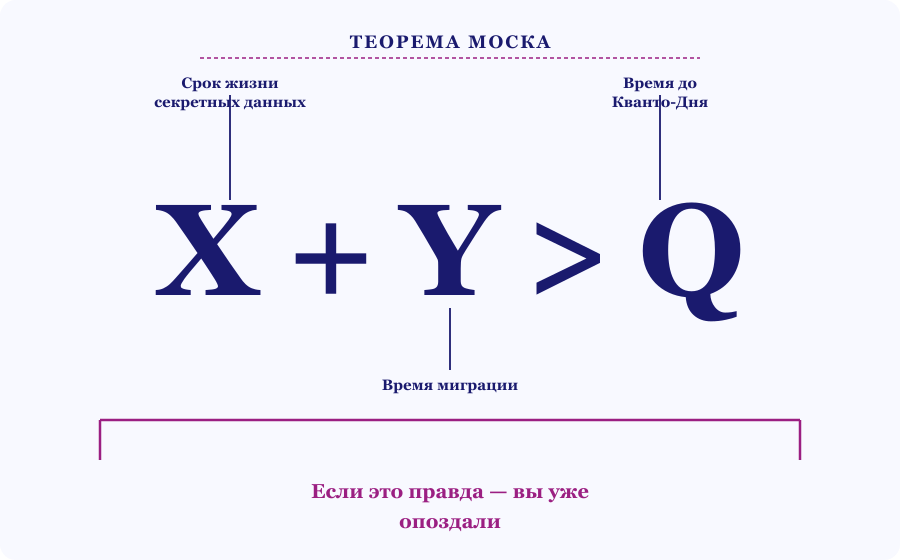
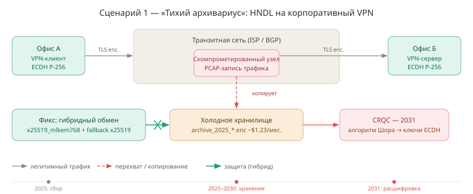
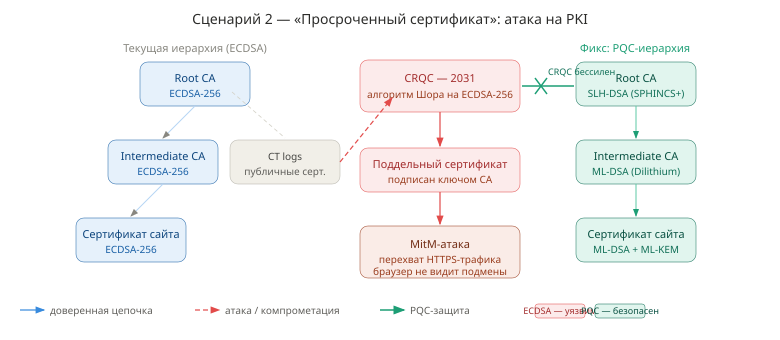
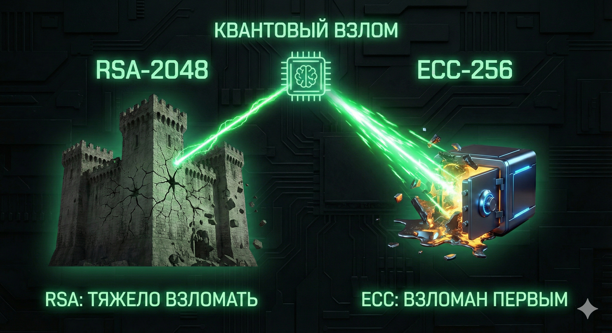
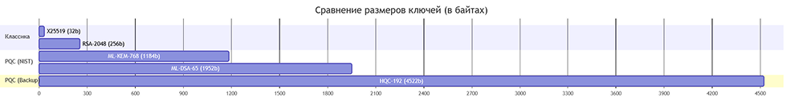
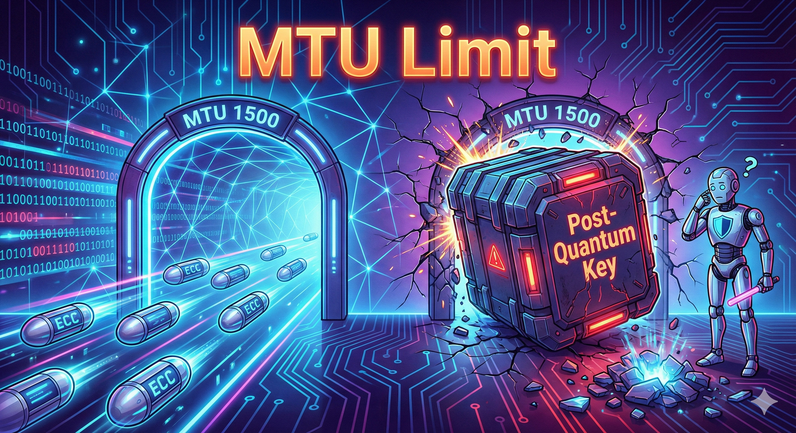
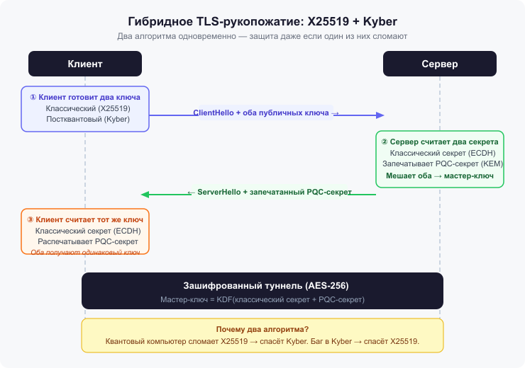
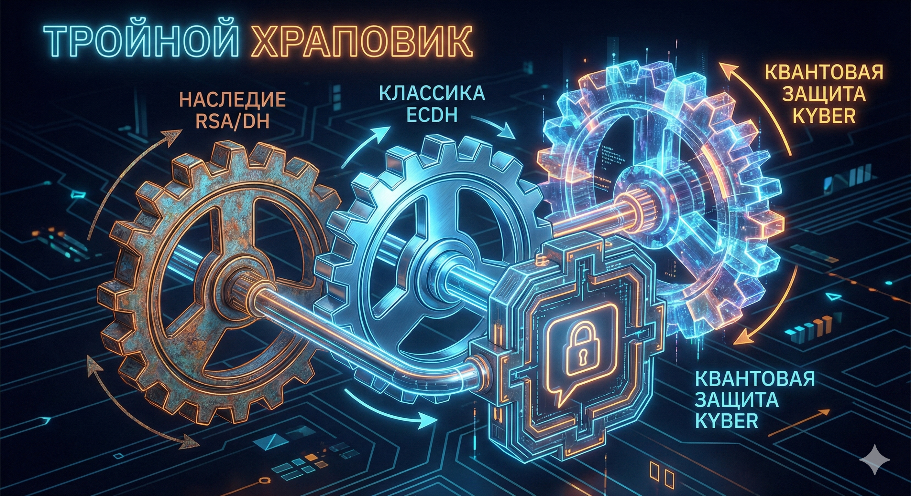

# Квантовый апокалипсис отменяется: инженерный гайд по переходу на Post-Quantum Cryptography (PQC)

## Об этом уроке

В 2024 году NIST опубликовал финальные стандарты пост-квантовой криптографии — и перевёл PQC из разряда «научных экспериментов» в разряд обязательных требований. Apple, Google и Signal уже внедрили защиту. В этом уроке вы узнаете, почему угроза реальна уже сейчас, какие алгоритмы выживут, а какие — нет, и как мигрировать инфраструктуру без потери совместимости.

**В уроке:**

- Стратегия «Harvest Now, Decrypt Later» — почему ваши данные собирают уже сегодня
- Стандарты NIST: ML-KEM, ML-DSA, SLH-DSA — чем отличаются и какой выбрать
- Почему AES-256 выживет, а RSA и ECC — нет
- Гибридная защита X25519 + Kyber — как внедрить, не сломав совместимость
- Инженерные боли: MTU, фрагментация, Middlebox Ossification

**Содержание:** Что такое PQC → Глазами хакера (угрозы + сценарии атак) → Глазами разработчика (алгоритмы + боли внедрения) → Предотвращение → Тест → Задание

---

== Раздел с теорией ==

## Что такое PQC?

13 августа 2024 года NIST утвердил стандарты FIPS 203, 204, 205 — это примерно как появление SSL в 90-х, только ставки выше. Apple внедрила PQC в iMessage (протокол PQ3), Google включил гибридный обмен ключами в Chrome, Signal перешёл на PQXDH.

Если ваш бэкенд использует жёстко прописанные параметры TLS, старые VPN-шлюзы или IoT-устройства с ограниченной памятью — переход на PQC потребует подготовки инфраструктуры, иначе сервис может сломаться ещё до того, как появится первый квантовый компьютер.

> **Главный тезис:** переход на PQC — это инженерная задача по миграции инфраструктуры. Начинать её нужно задолго до появления первого квантового компьютера.

---

## PQC глазами хакера

### Почему взлома ещё нет: парадокс NISQ

В новостях регулярно появляются заголовки о 100+ кубитных процессорах. Если для взлома RSA нужно ~4000 логических кубитов, почему интернет ещё не рухнул?

Ответ — в качестве кубитов. Сегодня мы живём в эпоху NISQ (Noisy Intermediate-Scale Quantum) — «шумных» квантовых компьютеров. Физические кубиты нестабильны: они теряют состояние (декогеренция) за микросекунды. Для взлома криптографии нужен **CRQC** (Cryptographically Relevant Quantum Computer), работающий с **логическими кубитами**. Один логический кубит — это конструкция из сотен физических кубитов, которые непрерывно занимаются коррекцией ошибок.


Оптимизация алгоритма Шора (Gidney Optimization, май 2025) снизила необходимое число физических кубитов для взлома RSA-2048 с ~20 миллионов до менее 1 миллиона. Прогноз появления CRQC сдвинулся с «никогда» на начало 2030-х.

### Стратегия HNDL: атака, которая уже идёт

Квантового компьютера ещё нет, но ваши данные **уже собирают**. Атака Harvest Now, Decrypt Later работает в три шага:

1. **Harvest (Сбор):** злоумышленник записывает зашифрованный трафик (TLS-сессии, VPN-туннели). Сейчас это выглядит как мусор.
2. **Store (Хранение):** терабайты данных складываются в холодные хранилища. Стоимость — копейки.
3. **Decrypt (Расшифровка):** когда появится CRQC, он перемалывает накопленные архивы.

Не критично: пароли от соцсетей — вы их меняете раз в полгода. Критично: банковские транзакции, медицинские данные (геном не перевыпустить), государственные и промышленные тайны, ключи IoT с долгим сроком службы.

> Если вы передаёте данные, которые должны оставаться секретными более 5 лет — вы **уже** уязвимы.

### Теорема Моска: математика неизбежности

Микеле Моска формализовал риск простым неравенством: **X + Y > Z**, где
X — срок жизни ваших данных (лет), Y — время на полную миграцию инфраструктуры
на PQC (лет, и это всегда дольше, чем кажется), Z — время до появления CRQC.
Если сумма X и Y превышает Z — данные будут скомпрометированы до того, как
вы успеете защититься. Проверьте себя с помощью калькулятора ниже.



```python
import datetime
from typing import Tuple

def check_quantum_risk(data_type: str, shelf_life_years: int, migration_estimate_years: int) -> Tuple[bool, int]:
    """Оценка риска по теореме Моска."""
    YEAR_CRQC_ARRIVAL = 2031
    current_year = datetime.date.today().year
    time_to_collapse_z = YEAR_CRQC_ARRIVAL - current_year
    total_exposure = shelf_life_years + migration_estimate_years

    print(f"--- Анализ для: {data_type} ---")
    if total_exposure > time_to_collapse_z:
        risk_gap = total_exposure - time_to_collapse_z
        print(f"🔴 КРИТИЧЕСКИЙ РИСК. Вы опоздали на {risk_gap} лет.")
        return False, risk_gap
    else:
        safety_margin = time_to_collapse_z - total_exposure
        print(f"🟢 Безопасно. Запас: {safety_margin} лет.")
        return True, safety_margin

if __name__ == "__main__":
    check_quantum_risk("Session Tokens", shelf_life_years=0, migration_estimate_years=3)
    check_quantum_risk("Genomic Data / Trade Secrets", shelf_life_years=15, migration_estimate_years=5)
```

---

### Сценарии атак

---

#### Сценарий 1 — «Тихий архивариус» (HNDL на корпоративный VPN)

**Идея.**
Злоумышленник перехватывает зашифрованный VPN-трафик между офисами и складывает в долгосрочное хранилище. Текущие алгоритмы делают архивы нечитаемыми — пока не появится CRQC.

**Эксплуатация пошагово.**

1. Противник получает позицию в транзитной сети (BGP hijacking, скомпрометированный ISP).
2. Записывает зашифрованный трафик в PCAP-файлы: TLS handshake + payload.
3. Сохраняет архивы в холодное хранилище — $1–2/ТБ в месяц.
4. После появления CRQC запускает алгоритм Шора на записанных TLS handshake'ах, восстанавливает ключи сессий.
5. Расшифровывает весь накопленный трафик ретроспективно.

== Интерактив: «Терпеливый Артем» ==
см файл INTERACTIVE.md и INTERACTIVE.html
== Конец интерактива ==


**Риск.**
Критичен для данных с долгим сроком жизни. Компрометация происходит задним числом — к моменту расшифровки атакующий остаётся незамеченным годами.

**Как быстро обнаружить.** 
Прямого индикатора нет — трафик выглядит легитимным. Единственное, что можно сделать до Q-Day: настройте netflow-мониторинг с алертами на аномальный исходящий объём через транзитные узлы (nfdump, Elastic Flow, или аналог). Это не остановит сбор архивов, но создаст baseline — и когда паттерн изменится, вы это увидите. Дополнительные косвенные признаки: неожиданные BGP-изменения маршрутов, появление «зеркал» трафика в логах.

**Исправление / фикс.**

```python
# До: только классический ECDH
ctx.set_key_exchange_group("secp256r1")

# После: гибридный обмен
ctx.set_key_exchange_groups([
    "x25519_mlkem768",  # квантово-устойчивый гибрид — предпочтительный
    "x25519"            # fallback для старых клиентов
])
```

Даже если CRQC взломает X25519 — ML-KEM-768 сохранит конфиденциальность. Для расшифровки нужно сломать оба алгоритма одновременно.



---

#### Сценарий 2 — «Просроченный сертификат» (атака на PKI)

**Идея.** Когда появится CRQC, злоумышленник восстановит приватный ключ из публичного сертификата любого CA. Это позволит подписывать произвольные сертификаты и выдавать себя за любой сайт.

**Эксплуатация пошагово.**

1. Противник собирает публичные сертификаты крупных CA (они общедоступны в Certificate Transparency logs).
2. После появления CRQC запускает алгоритм Шора на ECDSA-ключах CA.
3. Восстанавливает приватный ключ промежуточного или корневого CA.
4. Выписывает поддельный сертификат на любой домен — браузеры принимают его как валидный.
5. Проводит MitM-атаку: перехватывает и расшифровывает HTTPS-трафик.

**Риск.** Системный: под удар попадает вся PKI-инфраструктура интернета. Особенно критично для банков, корпоративных VPN с mTLS и платёжных систем.

**Как быстро обнаружить.** Мониторинг Certificate Transparency logs: `certspotter`, `crt.sh`, `cert-manager` с алертами. Аномалии в OCSP-ответах и CRL-обновлениях.

**Исправление / фикс.**

```
# Иерархия доверия после миграции:
Root CA:         SLH-DSA (SPHINCS+)  — максимальная консервативность, основан на хеш-функциях
Intermediate CA: ML-DSA (Dilithium)  — скорость + надёжность
End-entity cert: ML-DSA (Dilithium)  — подпись TLS-сертификатов
Key exchange:    ML-KEM (Kyber)      — обмен ключами в TLS handshake
```

> **Примечание.** Браузеры и ОС должны обновить хранилища корневых CA до ML-DSA/SLH-DSA. Apple, Google и Mozilla анонсировали планы поддержки PQC-сертификатов.



---

## PQC глазами разработчика

### Смерть классики: алгоритм Шора против RSA и ECC

Вся современная асимметричная криптография держится на **функциях с потайным входом** — задачах, которые легко решить в одну сторону и практически невозможно в обратную. RSA — на сложности факторизации больших чисел, ECC и DH — на сложности дискретного логарифмирования. Алгоритм Шора делает обе задачи тривиальными.

**Парадокс ECC:** ключ ECC-256 компактнее RSA-3072 при эквивалентной стойкости. В квантовом мире эта компактность оборачивается уязвимостью — более короткий ключ требует меньше кубитов для взлома. RSA-2048: ~4098 логических кубитов, ECDSA-256: ~2330. Эллиптические кривые, вероятно, падут первыми.



### AES выживает: алгоритм Гровера

AES не имеет математической периодичности, на которой работает алгоритм Шора. Здесь действует алгоритм Гровера — квадратичное ускорение перебора: N операций → √N. AES-128 даёт эффективные **64 бита** (небезопасно), AES-256 — эффективные **128 бит** (надёжно). Решение элегантно: просто удвоить длину ключа. AES-128 → **AES-256**, SHA-256 → **SHA-512**.


```python
from typing import Tuple

def calculate_quantum_security(algorithm_type: str, key_size_bits: int) -> Tuple[int, str]:
    alg = algorithm_type.strip().upper()
    if alg in ("RSA", "ECC"):
        effective_bits = 0
    elif alg == "SYMMETRIC":
        effective_bits = key_size_bits // 2
    else:
        return 0, "Неизвестный алгоритм"

    if effective_bits >= 128:
        verdict = "✅ БЕЗОПАСНО"
    elif effective_bits > 0:
        verdict = "⚠️ УЯЗВИМО — требуется обновление"
    else:
        verdict = "💀 ВЗЛОМАНО — срочная замена на PQC"

    return int(effective_bits), verdict

if __name__ == "__main__":
    algorithms = [("RSA", 2048), ("RSA", 4096), ("ECC", 256), ("SYMMETRIC", 128), ("SYMMETRIC", 256)]
    print(f"{'Алгоритм':<15} | {'Ключ':<5} | {'Квант. стойкость':<18} | {'Вердикт'}")
    print("-" * 70)
    for algo, size in algorithms:
        bits, status = calculate_quantum_security(algo, size)
        print(f"{algo:<15} | {size:<5} | {bits:<18} | {status}")
```

### Новый арсенал: стандарты NIST

**ML-KEM (ранее Kyber) — FIPS 203.** KEM (Key Encapsulation Mechanism) на модульных решётках (MLWE). Приходит на замену ECDH в TLS. Клиент отправляет публичный ключ — сервер инкапсулирует секрет и возвращает шифротекст — клиент декапсулирует его своим приватным ключом. На процессорах с AVX2 работает быстрее эллиптических кривых. Плата — размер данных:
публичный ключ занимает 1184 байта против 32 байт у X25519. Это нормально для
сервера в дата-центре, но важно учитывать при работе с IoT и медленными каналами.


```python
# Псевдокод: смена парадигмы DH → KEM

class ClassicECDH:
    def handshake(self):
        client_priv, client_pub = ec.generate_keypair()
        server_priv, server_pub = ec.generate_keypair()
        # Обе стороны независимо вычисляют общий секрет
        assert ec.compute_secret(client_priv, server_pub) == ec.compute_secret(server_priv, client_pub)

class PostQuantumKEM:
    def handshake(self):
        client_priv, client_pub = ml_kem.keygen()
        ciphertext, server_shared = ml_kem.encaps(client_pub)   # сервер инкапсулирует
        client_shared = ml_kem.decaps(ciphertext, client_priv)  # клиент декапсулирует
        assert client_shared == server_shared
```

Kyber закрывает задачу обмена ключами — но этого недостаточно: данные нужно
ещё и подписывать. Здесь в игру вступает **ML-DSA (ранее Dilithium) — FIPS 204** —
цифровая подпись на решётках, основной выбор для сертификатов и TLS.
Быстрая проверка подписи критична, когда браузер проверяет цепочки
сертификатов за миллисекунды.

ML-DSA быстрый, но держится на той же математике решёток, что и Kyber. Если
вам нужна независимая страховка — берите **SLH-DSA (ранее SPHINCS+) — FIPS 205.** Цифровая подпись на хеш-функциях. Безопасность не зависит от решёток — если в теории решёток найдут уязвимость, SLH-DSA выстоит. Медленный, подпись весит 8–40 КБ. Применять там, где проверка редка: подпись прошивок, корневые сертификаты.

**HQC — резервный KEM (4-й раунд, март 2025).** Основан на теории кодирования — математически независим от решёток. Страховка на случай, если в решётках найдут уязвимость.


|Задача|Алгоритм|
|---|---|
|Шифрование трафика|ML-KEM (Kyber)|
|Сертификаты и авторизация|ML-DSA (Dilithium)|
|Подпись ПО, долгосрочные ключи|SLH-DSA (SPHINCS+)|
|Резерв на случай провала решёток|HQC|

### Инженерные боли: MTU, фрагментация, Ossification

Главная проблема PQC — не сложность математики, а то, что она **тяжёлая**. Ключ X25519 занимает 32 байта. В мире PQC «бесплатная» безопасность заканчивается.


Стандартный MTU — **1500 байт**. Классический `ClientHello` в TLS 1.3 занимает 300–500 байт. При гибридном обмене (X25519 + ML-KEM-768) он вырастает на ~1200 байт и легко перевалит за MTU. Последствия: TCP-фрагментация, рост Latency на мобильных сетях на 20–40%, и главное — **Middlebox Ossification**: старые файрволы и DPI-системы дропают фрагментированные пакеты, не распознавая их как легитимный TLS. По данным Cloudflare и Google, ~1–2% соединений в интернете ломаются именно из-за этого.


```python
class NetworkPath:
    def __init__(self, mtu: int = 1500, drop_fragmented: bool = False):
        self.mtu = mtu
        self.drop_fragmented = drop_fragmented

    def transmit(self, data_bytes: bytes) -> bool:
        packet_size = len(data_bytes)
        effective_mtu = self.mtu - 40  # IP(20) + TCP(20)
        if packet_size <= effective_mtu:
            print("✅ Пакет прошёл целиком.")
            return True
        fragments = (packet_size + effective_mtu - 1) // effective_mtu
        print(f"⚠️ Разбито на {fragments} фрагмента(ов).")
        if self.drop_fragmented:
            print("🚫 Middlebox дропнул соединение.")
            return False
        print("✅ Фрагменты доставлены (latency вырос).")
        return True

if __name__ == "__main__":
    pqc_hello = b'\x00' * 1600
    print("--- Современный роутер ---")
    NetworkPath(drop_fragmented=False).transmit(pqc_hello)
    print("\n--- Legacy Firewall ---")
    NetworkPath(drop_fragmented=True).transmit(pqc_hello)
```



---

## Предотвращение: гибридная защита

### Паттерн «Ремень и подтяжки»: X25519 + Kyber



Решётки изучаются 20–30 лет, тогда как факторизация — столетиями. Риск математической ошибки в новых алгоритмах реальный. Поэтому применяется **гибридный обмен ключами**: две независимые пары секретов.

```
MasterSecret = KDF(SharedSecret_ECDH || SharedSecret_Kyber)
```

Защита падёт только если атакующий одновременно располагает CRQC **и** неизвестной уязвимостью в Kyber.


### Реальный кейс: Signal (PQXDH)

Signal в 2023–2024 гг. внедрил протокол **PQXDH** — первым среди массовых мессенджеров. Добавил Kyber-1024 в связку Pre-Keys рядом с Curve25519. Дополнительно — **Triple Ratchet**: ключи Kyber большие, поэтому их «размазывают» по нескольким сообщениям через Erasure Codes. Это обеспечивает Post-Compromise Security: если телефон взломали, через несколько сообщений канал снова станет квантово-устойчивым.



### Реализация гибридного KDF

```python
import hashlib
import hmac
import secrets
from typing import ByteString

def hkdf_extract(salt: bytes | None, input_key_material: ByteString) -> bytes:
    """Упрощённый HKDF-Extract (RFC 5869). Для production используйте полный HKDF."""
    if salt is None:
        salt = bytes([0] * hashlib.sha256().digest_size)
    return hmac.new(salt, input_key_material, hashlib.sha256).digest()

def derive_hybrid_secret(classic_secret: bytes, pqc_secret: bytes,
                         context_info: bytes = b"tls13_hybrid_handshake") -> bytes:
    """PRK = HKDF-Extract(0, Classic || PQC || context_info)."""
    combined_secret = classic_secret + pqc_secret + context_info
    return hkdf_extract(salt=None, input_key_material=combined_secret)

if __name__ == "__main__":
    alice_ecdh = secrets.token_bytes(32)
    alice_kyber = secrets.token_bytes(32)
    key_safe = derive_hybrid_secret(alice_ecdh, alice_kyber)

    # «Q-Day»: CRQC взломал ECDH
    attacker_guess = derive_hybrid_secret(alice_ecdh, secrets.token_bytes(32))
    print("✅ ЗАЩИТА: при взломе ECDH ключ не скомпрометирован."
          if attacker_guess != key_safe else "❌ Ключ угадан!")

    # «Math Fail»: уязвимость в Kyber
    attacker_guess_2 = derive_hybrid_secret(secrets.token_bytes(32), alice_kyber)
    print("✅ ЗАЩИТА: при взломе Kyber ключ не скомпрометирован."
          if attacker_guess_2 != key_safe else "❌ Ключ угадан!")
```

---

## Тест

**Вопрос 1.** Нужно ли срочно менять AES-256 на что-то принципиально новое?

- А) Да, AES полностью взломан алгоритмом Шора.
- Б) Нет, AES-256 достаточно — Гровер снижает стойкость лишь вдвое (до 128 бит), этого хватает.
- В) Да, нужно переходить на AES-512.

**Правильный ответ: Б.** Алгоритм Гровера даёт квадратичное ускорение: 256 бит → эффективные 128 бит. Достаточно.

---

**Вопрос 2.** Что произойдёт, если `ClientHello` из-за PQC-ключей превысит MTU (1500 байт)?

- А) Пакет просто фрагментируется на уровне TCP.
- Б) Соединение сразу разорвётся с ошибкой шифрования.
- В) Пакет фрагментируется, но старое оборудование (Middleboxes) может его дропнуть.

**Правильный ответ: В.** Риск Ossification: старые файрволы не распознают фрагментированный `ClientHello` как легитимный TLS.

---

**Вопрос 3.** В чём главный смысл гибридного обмена ключами?

- А) Использовать квантовый компьютер для генерации ключей.
- Б) Объединить ECDH и ML-KEM — данные останутся защищены, даже если один алгоритм окажется уязвимым.
- В) Использовать два PQC-алгоритма для ускорения.

**Правильный ответ: Б.** Если Kyber взломают математики — спасёт ECDH. Если ECDH взломает CRQC — спасёт Kyber.

---

**Вопрос 4.** Система обновления прошивки для спутника (срок службы 20 лет). Проверка редка, надёжность абсолютная. Какой алгоритм?

- А) ML-DSA (Dilithium)
- Б) SLH-DSA (SPHINCS+)
- В) RSA-4096

**Правильный ответ: Б.** SLH-DSA основан на хеш-функциях — максимально консервативный выбор для долгосрочного применения, не зависит от решёток.

---

**Вопрос 5.** Почему угроза HNDL актуальна, если CRQC ещё не существует?

- А) Хакеры уже используют квантовые эмуляторы.
- Б) Данные, перехваченные сегодня, будут расшифрованы через 10 лет, когда появится CRQC.
- В) Это маркетинговый ход.

**Правильный ответ: Б.** Долгоживущие секреты, украденные сегодня, будут прочитаны в будущем.

---

**Вопрос 6.** Какой стандарт NIST предназначен для замены ECDH, а не для подписи?

- А) ML-DSA
- Б) SLH-DSA
- В) ML-KEM (Kyber)

**Правильный ответ: В.** ML-KEM (Kyber) — Key Encapsulation Mechanism. Остальные — алгоритмы подписи.

---

**Вопрос 7.** Внедряете PQC на веб-сервере. Что сильнее всего повлияет на UX при плохом мобильном интернете?

- А) Нагрузка на процессор телефона при вычислении ключей.
- Б) Увеличение размера данных (Public Key + Ciphertext), повышающее Latency.
- В) Необходимость специального квантового браузера.

**Правильный ответ: Б.** Главная проблема PQC — «вес» ключей. На медленном канале лишние килобайты заметно замедляют открытие страницы.

---

## Задание на работу с кодом

**Контекст.** Вы — Backend-разработчик в финтех-стартапе. Конфигурация TLS уязвима для атаки HNDL. Задача — перевести сервис на гибридную схему с поддержкой обратной совместимости (Crypto Agility).

**Исходный код (Legacy):**

```python
from hypothetical_ssl_lib import SSLContext, Protocols

def create_context():
    ctx = SSLContext(protocol=Protocols.TLSv1_3)
    # [УЯЗВИМОСТЬ 1] ECDH без квантовой защиты — весь трафик уязвим для HNDL
    ctx.set_key_exchange_group("secp256r1")
    # [УЯЗВИМОСТЬ 2] AES-128 — Гровер снижает стойкость до 64 бит
    ctx.set_ciphers("TLS_AES_128_GCM_SHA256")
    return ctx
```

**Задание:**

1. Замените группу обмена ключами на гибридную (X25519 + Kyber768).
2. Добавьте fallback на X25519 для старых клиентов (не RSA).
3. Обновите симметричный шифр для устойчивости к Гроверу.

**Подсказки:** для защиты от Гровера нужен ключ ≥ 256 бит; метод принимает список, порядок определяет приоритет; гибридная группа — `x25519_mlkem768`.

**Ответ (исправленный код):**

```python
from hypothetical_ssl_lib import SSLContext, Protocols

def create_quantum_safe_context():
    ctx = SSLContext(protocol=Protocols.TLSv1_3)
    ctx.set_key_exchange_groups([
        "x25519_mlkem768",  # гибрид — предпочтительный
        "x25519"            # fallback для старых клиентов
    ])
    ctx.set_ciphers([
        "TLS_AES_256_GCM_SHA384",
        "TLS_CHACHA20_POLY1305_SHA256"  # для мобильных без аппаратного AES
    ])
    return ctx
```

**Объяснение:** X25519 защищает от математической ошибки в Kyber, ML-KEM-768 — от CRQC. Fallback сохраняет доступность. AES-256 закрывает уязвимость перед алгоритмом Гровера.
