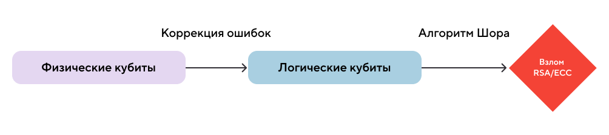
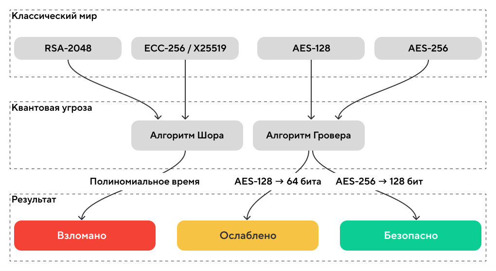
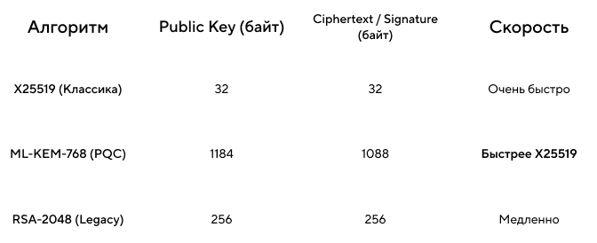
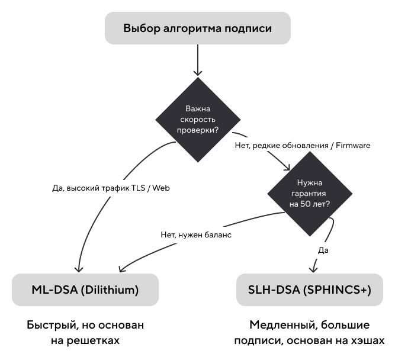
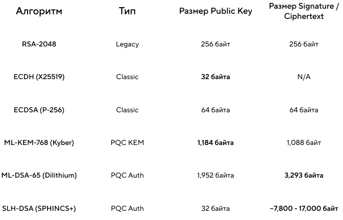
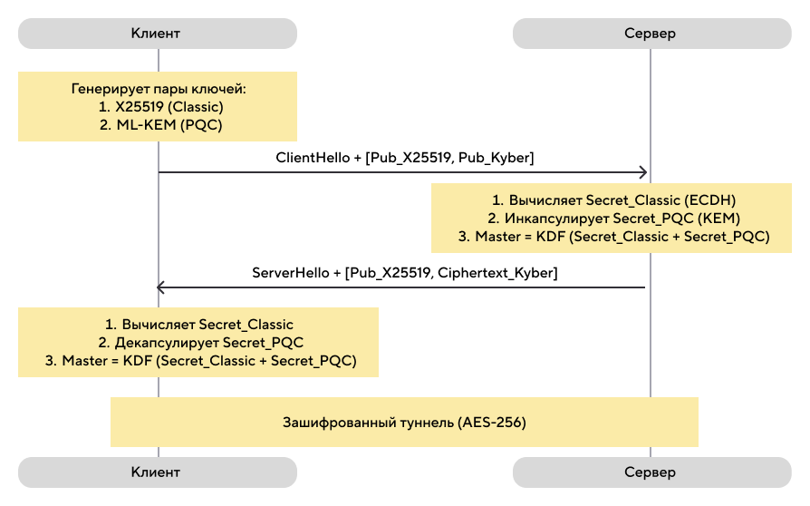

# Квантовый апокалипсис отменяется: инженерный гайд по переходу на Post-Quantum Cryptography (PQC)

## Об этом уроке

- Почему ваши данные под угрозой уже сейчас, хотя мощного квантового компьютера ещё не существует?
- Что такое стратегия «Harvest Now, Decrypt Later» и какие данные она затрагивает?
- Чем новые стандарты NIST (ML-KEM, ML-DSA, SLH-DSA) отличаются друг от друга и какой выбрать?
- Почему AES-256 выживет, а RSA и ECC — нет?
- Как внедрить гибридную защиту сегодня, не ломая совместимость со старыми клиентами?

## Оглавление

- [Что такое PQC](#что-такое-pqc-и-почему-мы-переходим-на-него-сейчас) — NIST 2024, почему это касается каждого инженера.
- [PQC глазами хакера](#pqc-глазами-хакера) — NISQ, CRQC, стратегия HNDL («собирай сейчас — читай потом»), теорема Моска.
- [PQC глазами разработчика](#pqc-глазами-разработчика)— алгоритм Шора против RSA и ECC, алгоритм Гровера против AES.
- [Почему PQC опасно внедрять неправильно](#почему-pqc-опасно-внедрять-неправильно) — размер ключей, MTU, фрагментация, Middlebox Ossification.
- [Предотвращение: гибридная защита](#предотвращение-стратегия-миграции-и-гибридная-защита)— паттерн X25519 + Kyber, кейс Signal (PQXDH), реализация KDF.
- [Тест](#тест)— 7 вопросов среднего уровня.
- [Задание на работу с кодом](#задание-на-работу-с-кодом)— найти и исправить уязвимости в конфигурации TLS.

---

## Что такое PQC и почему мы переходим на него сейчас?

13 августа 2024 года NIST опубликовал финальные стандарты пост-квантовой криптографии (FIPS 203, 204, 205). Это событие перевело PQC из разряда «научных экспериментов» в разряд обязательных требований — примерно так же, как в 90-х появление SSL изменило правила игры для всего веба.

Apple внедрила PQC в iMessage (протокол PQ3), Google включил гибридный обмен ключами в Chrome, Signal перешёл на PQXDH.

Если ваш бэкенд использует жёстко прописанные параметры TLS, старые VPN-шлюзы или IoT-устройства с ограниченной памятью — переход на PQC может «положить» ваш сервис даже без всякой атаки. Просто потому что новые ключи не влезают в старые пакеты.

> **Главный тезис:** переход на PQC — это инженерная задача по миграции инфраструктуры. Начинать её нужно задолго до появления первого квантового компьютера.

---

## PQC глазами хакера

### Парадокс NISQ: кубиты есть, взлома нет

В новостях регулярно появляются заголовки о 100+ кубитных процессорах. Если для взлома RSA нужно ~4000 логических кубитов, почему интернет ещё не рухнул?

Ответ — в качестве кубитов. Сегодня мы живём в эпоху NISQ (Noisy Intermediate-Scale Quantum) — «шумных» квантовых компьютеров. Физические кубиты нестабильны: они теряют состояние (декогеренция) за микросекунды.

Для взлома криптографии нужен **CRQC** (Cryptographically Relevant Quantum Computer), работающий с **логическими кубитами**. Один логический кубит — это конструкция из сотен физических кубитов, которые непрерывно занимаются коррекцией ошибок друг у друга.



Оптимизация алгоритма Шора (Gidney Optimization, май 2025) снизила необходимое число физических кубитов для взлома RSA-2048 с ~20 миллионов до менее 1 миллиона. Прогноз появления CRQC сдвинулся с «никогда» на начало 2030-х.

### Harvest Now, Decrypt Later (HNDL): терпеливый противник

Квантового компьютера ещё нет, но ваши данные **уже собирают**. Атака HNDL работает в три шага:

1. **Harvest (Сбор):** злоумышленник записывает весь зашифрованный трафик (TLS-сессии, VPN-туннели) через подконтрольные узлы. Сейчас это выглядит как мусор.
2. **Store (Хранение):** терабайты данных складываются в холодные хранилища на 5–10 лет. Стоимость хранения в 2025 году — копейки.
3. **Decrypt (Расшифровка):** когда появится CRQC, он начнёт «перемалывать» накопленные архивы.

**Что под угрозой?**

- Не критично: пароли от соцсетей — вы их и так меняете раз в полгода.
- Критично: банковские транзакции, медицинские данные (геном, в отличие от пароля, не перевыпустить), государственные и промышленные тайны, ключи IoT-устройств с долгим сроком службы.

> Если вы передаёте данные, которые должны оставаться секретными более 5 лет — вы **уже** уязвимы.

---

### Знакомьтесь: Артём

Артём — аналитик данных в небольшой компании. Днём он строит графики в Excel и пьёт третий кофе, а по ночам… по ночам он работает над долгосрочным инвестиционным проектом.

Артём перехватывает корпоративный трафик крупного банка и аккуратно складывает его на жёсткий диск.

Он не спешит. У него есть план.

Коллеги называют его «самым терпеливым человеком в комнате». Артём только улыбается и запускает очередной дамп TLS-сессий в архив.

### Шаг 1. Сбор урожая

*Место действия: арендованный сервер где-то на Северо-Западе. 2025 год.*

Артём настраивает перехват трафика через подконтрольный ему узел. Банк использует TLS 1.3 с RSA-2048 и ECDH на кривой P-256. Всё по учебнику. Всё надёжно.

— Сейчас — да, — бормочет Артём и запускает сниффер.

```
[CAPTURE] TLS session dump → archive_2025_01.enc  [4.2 GB]
[CAPTURE] TLS session dump → archive_2025_02.enc  [3.8 GB]
[CAPTURE] TLS session dump → archive_2025_03.enc  [5.1 GB]
...
```

Трафик зашифрован. Артём это знает. Его это не беспокоит.

**Что происходит технически:** злоумышленник записывает зашифрованные TLS-сессии целиком — включая факт обмена ключами (ClientHello, ServerHello). Расшифровать их сейчас невозможно: RSA-2048 и ECDH надёжно защищают содержимое. Но сами зашифрованные данные никуда не деваются.

### Шаг 2. Холодное хранение

Артём архивирует дампы и отправляет их в холодное хранилище. За месяц набирается около 60 ГБ корпоративного трафика банка: транзакции, внутренние API, переписка систем.

```
> tar -czf archive_2025_01.enc.gz ./harvest/2025-01/*
> rclone copy archive_2025_01.enc.gz cold-storage:/bank_harvest/
> du -sh cold-storage:/bank_harvest/
61.4 GB    total
> echo "Стоимость хранения: 1.23 в месяц. Дешевле подписки на стриминг."
```

Артём закрывает ноутбук и идёт спать. Завтра — обычный рабочий день.

**Что происходит технически:** стоимость хранения данных настолько мала, что долгосрочное накопление зашифрованного трафика экономически тривиально. Терабайты архивов ждут своего часа годами.

### Шаг 3. Ожидание

*2025 → 2026 → 2027 → ... → 2031*

Артём продолжает работать аналитиком. Читает новости о квантовых компьютерах. Следит за публикациями IBM и Google. Обновляет софт на своём сервере.

Однажды утром он видит заголовок:

> **«Google объявляет о первом CRQC: RSA-2048 взломан за 4 часа»**

Артём медленно допивает кофе и открывает терминал.

```
> ./check_quantum_news --alert "CRQC achieved"
Результат: ПОЛОЖИТЕЛЬНЫЙ. Начинаю подготовку архивов.
```

**Что происходит технически:** CRQC — это квантовый компьютер, способный запустить алгоритм Шора на реальных криптографических ключах. Для RSA-2048 это ~4000 логических кубитов. Для ECDH P-256 — ~2330. Эллиптические кривые падут первыми.

### Шаг 4. Час расплаты

*2031 год. Артём достаёт архивы шестилетней давности.*

```
> rclone copy cold-storage:/bank_harvest/archive_2025_01.enc.gz ./decrypt/
> gunzip archive_2025_01.enc.gz
> ls -lh
-rw-r--r--  1 artem  staff    61G archive_2025_01.enc

> quantum_shor_client --algorithm ECDH-P256 --target archive_2025_01.enc
[INFO] Загружено 61400 TLS-сессий.
[INFO] Восстановление session key для сессии 2025-01-15 10:23:17...
[████████████░░░░] 80% (оценка времени: 45 мин)
[████████████████] 100%

[SUCCESS] Session key recovered: a3f9e4b7c812d5467f1a9b3c5d7e8f2a

> decrypt_tls_session --key a3f9e4b7c812d5467f1a9b3c5d7e8f2a --input harvest_20250115_102317.enc
[SUCCESS] Расшифровано → decrypted_20250115_102317.json

> cat decrypted_20250115_102317.json | jq '.'
{
  "transaction_id": "TXN-20250115-009823",
  "from_account": "****4471",
  "to_account":   "****8832",
  "amount":        2850000,
  "currency":      "RUB",
  "timestamp":    "2025-01-15T10:23:18Z",
  "auth_token":   "eyJhbGciOiJIUzI1NiIsInR5cCI6IkpXVCJ9..."
}
```

Артём смотрит на экран. Шесть лет ожидания. Один скрипт. Полный архив транзакций крупного банка за месяц.

— Терпение, — говорит он сам себе и открывает следующий файл. — Терпение и труд всё перетрут.

**Что происходит технически:** алгоритм Шора позволяет восстановить приватный ключ из публичного за полиномиальное время. Имея ключ сессии ECDH, атакующий расшифровывает всю переписку этой сессии — включая данные, переданные годы назад. Именно поэтому атака называется Harvest Now, Decrypt Later: момент кражи и момент прочтения разделены во времени.


### Что пошло не так?

Банк из нашей истории совершил три ошибки:

1. **Использовал ECDH P-256** — эллиптические кривые уязвимы для алгоритма Шора. Ключ короткий, кубитов нужно меньше — ECC падает первой.
2. **Не внедрил гибридный обмен ключами** — добавив ML-KEM (Kyber) рядом с ECDH, банк защитил бы архивные данные: для расшифровки Артёму понадобился бы и квантовый компьютер, и математическая уязвимость в Kyber одновременно.
3. **Откладывал миграцию** — по теореме Моска, если срок жизни данных (X) плюс время на миграцию (Y) превышают время до CRQC (Z), вы уже опоздали.

**Мог ли Артём потерпеть неудачу?**

Да — если бы банк внедрил гибридный обмен ключами до того, как Артём начал собирать архивы:

```
MasterSecret = KDF(SharedSecret_ECDH || SharedSecret_Kyber)
```

Даже имея квантовый компьютер и взломав ECDH, Артём получил бы только половину входных данных для KDF. Итоговый ключ сессии остался бы недостижимым.

Артём закрыл бы ноутбук и пошёл спать — уже без планов на утро.

---

### Теорема Моска: математика неизбежности

Микеле Моска формализовал этот риск простым неравенством:


Вот калькулятор для самопроверки:

```python
import datetime
from typing import Tuple

def check_quantum_risk(data_type: str, shelf_life_years: int, migration_estimate_years: int) -> Tuple[bool, int]:
    """
    Оценка риска по теореме Моска.
    :param shelf_life_years: X — сколько лет данные должны быть секретны
    :param migration_estimate_years: Y — сколько лет займёт внедрение PQC
    :return: (is_safe, gap_years)
    """
    YEAR_CRQC_ARRIVAL = 2032
    current_year = datetime.date.today().year
    time_to_collapse_z = YEAR_CRQC_ARRIVAL - current_year
    total_exposure = shelf_life_years + migration_estimate_years

    print(f"--- Анализ для: {data_type} ---")
    if total_exposure > time_to_collapse_z:
        risk_gap = total_exposure - time_to_collapse_z
        print(f"🔴 КРИТИЧЕСКИЙ РИСК. Вы опоздали на {risk_gap} лет.")
        return False, risk_gap
    else:
        safety_margin = time_to_collapse_z - total_exposure
        print(f"🟢 Безопасно. Запас: {safety_margin} лет.")
        return True, safety_margin

if __name__ == "__main__":
    check_quantum_risk("Session Tokens", shelf_life_years=0, migration_estimate_years=3)
    check_quantum_risk("Genomic Data / Trade Secrets", shelf_life_years=15, migration_estimate_years=5)
```

---

## PQC глазами разработчика

### Смерть классики: алгоритм Шора против RSA и ECC

Вся современная асимметричная криптография держится на **функциях с потайным входом (trapdoor functions)** — математических задачах, которые легко решить в одну сторону и практически невозможно в обратную.

- **RSA** — на сложности факторизации больших чисел.
- **ECC и DH** — на сложности дискретного логарифмирования.

Алгоритм Шора (1994) позволяет квантовому компьютеру находить период функции за полиномиальное время — и обе задачи мгновенно становятся тривиальными.

**Парадокс ECC:** мы привыкли считать его безопаснее RSA — ключ ECC-256 эквивалентен RSA-3072, но компактнее. В квантовом мире эта компактность оборачивается уязвимостью: более короткий ключ требует меньше кубитов для взлома.

- RSA-2048: ~4098 логических кубитов.
- ECDSA-256: ~2330 логических кубитов.

Эллиптические кривые, вероятно, падут первыми — раньше, чем у атакующих хватит мощности на «старый добрый» RSA.


### Алгоритм Гровера против AES: симметрия держит удар

AES и ChaCha20 не имеют математической периодичности, на которой «едет» алгоритм Шора. Здесь работает алгоритм Гровера — квантовый поиск с квадратичным ускорением: если классическому перебору нужно N операций, Гроверу достаточно √N.

- AES-128 → эффективные **64 бита** — небезопасно.
- AES-256 → эффективные **128 бит** — по-прежнему надёжно.

Решение элегантно: не менять математику, а просто удвоить длину ключа. AES-128 → **AES-256**, SHA-256 → **SHA-512**.



```python
from typing import Tuple

def calculate_quantum_security(algorithm_type: str, key_size_bits: int) -> Tuple[int, str]:
    """
    algorithm_type: 'RSA', 'ECC', 'SYMMETRIC'.
    Для RSA/ECC — алгоритм Шора даёт 0 эффективных бит (упрощение).
    Для SYMMETRIC — алгоритм Гровера даёт key_size_bits // 2.
    """
    alg = algorithm_type.strip().upper()
    if alg in ("RSA", "ECC"):
        effective_bits = 0
    elif alg == "SYMMETRIC":
        effective_bits = key_size_bits // 2
    else:
        return 0, "Неизвестный алгоритм"

    if effective_bits >= 128:
        verdict = "✅ БЕЗОПАСНО"
    elif effective_bits > 0:
        verdict = "⚠️ УЯЗВИМО — требуется обновление"
    else:
        verdict = "💀 ВЗЛОМАНО — срочная замена на PQC"

    return int(effective_bits), verdict

if __name__ == "__main__":
    algorithms = [
        ("RSA", 2048), ("RSA", 4096),
        ("ECC", 256),
        ("SYMMETRIC", 128),
        ("SYMMETRIC", 256),
    ]
    print(f"{'Алгоритм':<15} | {'Ключ':<5} | {'Квант. стойкость':<18} | {'Вердикт'}")
    print("-" * 70)
    for algo, size in algorithms:
        bits, status = calculate_quantum_security(algo, size)
        print(f"{algo:<15} | {size:<5} | {bits:<18} | {status}")
```

### Новый арсенал: стандарты NIST

**ML-KEM (ранее Kyber) — FIPS 203**

Тип: Key Encapsulation Mechanism (KEM). Основа: модульные решётки (MLWE). Приходит на замену ECDH в TLS.

Ключевое отличие от привычного Диффи-Хеллмана: KEM асимметричен. Клиент отправляет публичный ключ — сервер *инкапсулирует* в него секрет и отправляет шифротекст обратно — клиент *декапсулирует* его своим приватным ключом. Никакого «встречного обмена», только конверт и посылка.

```python
# Псевдокод: смена парадигмы DH → KEM (TLS-style flow)

class ClassicECDH:
    def handshake(self):
        client_priv, client_pub = ec.generate_keypair()
        server_priv, server_pub = ec.generate_keypair()
        # Обе стороны обмениваются публичными ключами и независимо вычисляют общий секрет
        client_shared = ec.compute_secret(client_priv, server_pub)
        server_shared = ec.compute_secret(server_priv, client_pub)
        assert client_shared == server_shared
        return client_shared

class PostQuantumKEM:
    def handshake(self):
        # Клиент генерирует keypair и отправляет публичный ключ
        client_priv, client_pub = ml_kem.keygen()
        # Сервер инкапсулирует секрет и отправляет шифротекст
        ciphertext, server_shared_secret = ml_kem.encaps(client_pub)
        # Клиент декапсулирует шифротекст своим приватным ключом
        client_shared_secret = ml_kem.decaps(ciphertext, client_priv)
        assert client_shared_secret == server_shared_secret
        return client_shared_secret
```

На современных процессорах с AVX2 Kyber работает быстрее, чем операции над эллиптическими кривыми. Плата за скорость — размер данных.




**ML-DSA (ранее Dilithium) — FIPS 204**

Тип: цифровая подпись. Основа: модульные решётки. Основной выбор для сертификатов, авторизации, TLS. Быстрая проверка подписи — критично, когда браузер проверяет цепочки сертификатов за миллисекунды.

**SLH-DSA (ранее SPHINCS+) — FIPS 205**

Тип: цифровая подпись. Основа: хеш-функции (Stateless Hash-based). Его безопасность не зависит от решёток — если математики внезапно «уронят» теорию решёток, SLH-DSA выстоит. Медленный, подпись весит 8–40 КБ. Применять там, где проверка редка, а паранойя оправдана: подпись прошивок, корневые сертификаты.



**HQC — резервный KEM (4-й раунд, март 2025)**

Основан на теории кодирования — математически независим от решёток. Работает медленнее Kyber и имеет большие ключи, но служит страховкой на случай, если в теории решёток найдут уязвимость.

**Итоговая схема по задачам:**

| Задача | Алгоритм |
|---|---|
| Шифрование трафика | ML-KEM (Kyber) |
| Сертификаты и авторизация | ML-DSA (Dilithium) |
| Подпись ПО, долгосрочные ключи | SLH-DSA (SPHINCS+) |
| Резерв на случай провала решёток | HQC |

---

## Почему PQC опасно внедрять неправильно

### Размер имеет значение

Главная проблема PQC — не сложность математики, а то, что она **тяжёлая**. Ключ X25519 занимает 32 байта — меньше, чем HTTP-заголовки. В мире PQC «бесплатная» безопасность заканчивается.




> Если вы используете SLH-DSA для подписи, подпись может весить больше, чем само сообщение.

### Проблема «толстого ClientHello» и Middlebox Ossification

Стандартный MTU в большинстве сетей — **1500 байт**. Классический `ClientHello` в TLS 1.3 занимает 300–500 байт. При гибридном обмене (X25519 + ML-KEM-768) он вырастает на ~1200 байт и легко перевалит за MTU.

**Последствия:**

1. **TCP-фрагментация:** `ClientHello` разбивается на два и более пакета, сервер ждёт все куски.
2. **Рост Latency:** на нестабильных мобильных сетях время установки соединения увеличивается на 20–40%.
3. **Middlebox Ossification:** старые файрволы и DPI-системы могут дропать фрагментированные пакеты — они просто не распознают их как легитимный TLS. По данным Cloudflare и Google, ~1–2% соединений в интернете ломаются именно из-за этого. Немного — пока не считать в абсолютных числах.


```python
# Симулятор поведения сетевого шлюза (Middlebox)

class NetworkPath:
    def __init__(self, mtu: int = 1500, drop_fragmented: bool = False):
        self.mtu = mtu
        self.drop_fragmented = drop_fragmented

    def transmit(self, data_bytes: bytes) -> bool:
        """Возвращает True, если пакет успешно доставлен."""
        packet_size = len(data_bytes)
        headers_size = 40  # IP(20) + TCP(20)
        effective_mtu = self.mtu - headers_size

        print(f"📦 Отправляем пакет {packet_size} байт...")

        if packet_size <= effective_mtu:
            print("✅ Пакет прошёл целиком.")
            return True

        fragments = (packet_size + effective_mtu - 1) // effective_mtu
        print(f"⚠️ Пакет превышает MTU. Разбито на {fragments} фрагмента(ов).")

        if self.drop_fragmented:
            print("🚫 Middlebox дропнул соединение. (Ossification)")
            return False

        print("✅ Фрагменты доставлены (latency вырос).")
        return True

if __name__ == "__main__":
    classic_hello = b'\x00' * 300   # обычный ClientHello
    pqc_hello = b'\x00' * 1600      # «толстый» ClientHello с Kyber-768

    print("--- Современный роутер ---")
    NetworkPath(mtu=1500, drop_fragmented=False).transmit(pqc_hello)

    print("\n--- Корпоративный Legacy Firewall ---")
    NetworkPath(mtu=1500, drop_fragmented=True).transmit(pqc_hello)
```

### Производительность: Kyber быстрее, чем кажется

ML-KEM-768 на современном Intel Xeon работает быстрее X25519 — матричные операции и хеширование процессор любит больше, чем математику эллиптических кривых.

Подвох — в сети. Вы выигрываете микросекунды на CPU, но теряете миллисекунды на передаче лишних килобайтов. Для сервера в дата-центре это незаметно. Для IoT-устройства на краю сети с плохим каналом — это батарея, которая кончается раньше срока.

---

## Предотвращение: стратегия миграции и гибридная защита

### Паттерн «Ремень и подтяжки»: X25519 + Kyber

Главный страх при переходе на PQC — что в новых алгоритмах найдут математическую ошибку. Решётки изучаются 20–30 лет, тогда как факторизация — столетиями. Риск реальный.

Чтобы не выбирать между «защитой от квантового компьютера» и «защитой от математической ошибки», применяется **гибридный обмен ключами**: стороны договариваются сразу о **двух** независимых секретах.

1. **Classic Secret:** через ECDH (X25519) — проверен временем, уязвим для CRQC.
2. **PQC Secret:** через ML-KEM — устойчив к CRQC, теоретически может содержать новые математические уязвимости.

Финальный ключ:

```
MasterSecret = KDF(SharedSecret_Classic || SharedSecret_PQC)
```

Защита падёт только если атакующий одновременно располагает квантовым компьютером **и** знанием неизвестной уязвимости в Kyber. Что, согласитесь, уже нетривиальное требование к противнику.


**Схема TLS-рукопожатия с гибридным обменом:**



### Реальный кейс: Signal (PQXDH) и Triple Ratchet

Signal в 2023–2024 гг. внедрил протокол **PQXDH** (Post-Quantum Extended Diffie-Hellman) — первым среди массовых мессенджеров. Сложность здесь в асинхронности: в отличие от TLS, собеседник может быть офлайн, и ключи заранее загружены на сервер (Pre-Keys).

Signal добавил в связку ключей пост-квантовый ключ Kyber-1024. Когда Алиса пишет Бобу — она скачивает его классический ключ (Curve25519) и PQC-ключ (Kyber-1024), генерирует оба секрета, смешивает их для создания первого ключа шифрования.

Дополнительно Signal внедряет **Triple Ratchet** — к классическому «двойному храповику» добавляется слой SPQR (Sparse Post-Quantum Ratchet). Поскольку ключи Kyber большие, их «размазывают» по нескольким сообщениям через Erasure Codes. Это обеспечивает **Post-Compromise Security**: если телефон взломали, через несколько сообщений канал снова станет квантово-устойчивым.


### Реализация гибридного KDF

```python
import hashlib
import hmac
import secrets
from typing import ByteString

def hkdf_extract(salt: bytes | None, input_key_material: ByteString) -> bytes:
    """
    Упрощённый HKDF-Extract (RFC 5869).
    Для production используйте полный HKDF (Extract + Expand).
    """
    if salt is None:
        salt = bytes([0] * hashlib.sha256().digest_size)
    return hmac.new(salt, input_key_material, hashlib.sha256).digest()

def derive_hybrid_secret(classic_secret: bytes, pqc_secret: bytes,
                         context_info: bytes = b"tls13_hybrid_handshake") -> bytes:
    """
    PRK = HKDF-Extract(0, Classic || PQC || context_info).
    context_info — метка протокола для key separation.
    Порядок конкатенации должен быть зафиксирован в протоколе.
    """
    combined_secret = classic_secret + pqc_secret + context_info
    return hkdf_extract(salt=None, input_key_material=combined_secret)

if __name__ == "__main__":
    alice_ecdh = secrets.token_bytes(32)
    alice_kyber = secrets.token_bytes(32)
    key_safe = derive_hybrid_secret(alice_ecdh, alice_kyber)
    print(f"Normal Key: {key_safe.hex()[:16]}...")

    # «Q-Day»: атакующий знает ECDH-секрет
    attacker_guess = derive_hybrid_secret(alice_ecdh, secrets.token_bytes(32))
    print("✅ ЗАЩИТА РАБОТАЕТ: при взломе ECDH итоговый ключ не скомпрометирован."
          if attacker_guess != key_safe else "❌ ОШИБКА: Ключ угадан!")

    # «Math Fail»: атакующий знает Kyber-секрет
    attacker_guess_2 = derive_hybrid_secret(secrets.token_bytes(32), alice_kyber)
    print("✅ ЗАЩИТА РАБОТАЕТ: при взломе Kyber итоговый ключ не скомпрометирован."
          if attacker_guess_2 != key_safe else "❌ ОШИБКА: Ключ угадан!")
```

---

## Тест

**Вопрос 1.**
Нужно ли срочно менять AES-256 на что-то принципиально новое для защиты от квантовых компьютеров?

- А) Да, AES полностью взломан алгоритмом Шора.
- Б) Нет, AES-256 достаточно — алгоритм Гровера снижает стойкость лишь вдвое (до 128 бит), что остаётся безопасным.
- В) Да, нужно переходить на AES-512 или AES-1024.

**Правильный ответ: Б.**
AES-256 устойчив. Алгоритм Гровера даёт квадратичное ускорение: 256 бит превращаются в эффективные 128 бит.

---

**Вопрос 2.**
Что произойдёт с TLS-рукопожатием, если размер `ClientHello` из-за PQC-ключей превысит MTU (1500 байт)?

- А) Ничего страшного, пакет просто фрагментируется на уровне TCP.
- Б) Соединение мгновенно разорвётся с ошибкой шифрования.
- В) Пакет фрагментируется, но старое сетевое оборудование (Middleboxes) может его дропнуть — соединение зависнет.

**Правильный ответ: В.**
Риск Ossification: старые файрволы не распознают фрагментированный `ClientHello` как легитимный TLS и дропают его.

---

**Вопрос 3.**
В чём главный смысл гибридного обмена ключами (Hybrid Key Exchange)?

- А) Использовать квантовый компьютер для генерации ключей.
- Б) Объединить классический алгоритм (ECDH) и пост-квантовый (ML-KEM) — данные останутся защищены, даже если один из алгоритмов окажется уязвимым.
- В) Использовать два разных пост-квантовых алгоритма для ускорения работы.

**Правильный ответ: Б.**
«Ремень и подтяжки»: если Kyber взломают математики — спасёт ECDH. Если ECDH взломает квантовый компьютер — спасёт Kyber.

---

**Вопрос 4.**
Вы разрабатываете систему обновления прошивки для спутника (срок службы — 20 лет). Проверка подписи редка, размер не критичен, но надёжность должна быть абсолютной. Какой алгоритм выбрать?

- А) ML-DSA (Dilithium)
- Б) SLH-DSA (SPHINCS+)
- В) RSA-4096

**Правильный ответ: Б.**
SLH-DSA основан на хеш-функциях, а не на решётках — максимально консервативный выбор для долгосрочного применения.

---

**Вопрос 5.**
Почему угроза HNDL актуальна сегодня, если мощного квантового компьютера ещё нет?

- А) Потому что хакеры уже используют квантовые эмуляторы.
- Б) Потому что данные, перехваченные сегодня, могут быть расшифрованы через 10 лет, когда появится квантовый компьютер.
- В) Это маркетинговый ход, угрозы не существует.

**Правильный ответ: Б.**
Долгоживущие секреты (медицинские данные, государственные тайны), украденные сегодня, будут прочитаны в будущем.

---

**Вопрос 6.**
Какой из стандартов NIST предназначен для замены протокола обмена ключами (как ECDH), а не для цифровой подписи?

- А) ML-DSA
- Б) SLH-DSA
- В) ML-KEM (Kyber)

**Правильный ответ: В.**
ML-KEM (Kyber) — это Key Encapsulation Mechanism. Остальные — алгоритмы подписи.

---

**Вопрос 7.**
Вы внедряете PQC на веб-сервере. Какой фактор сильнее всего повлияет на UX при плохом мобильном интернете?

- А) Высокая нагрузка на процессор телефона при вычислении ключей.
- Б) Увеличение размера передаваемых данных (Public Key + Ciphertext), что повышает Latency.
- В) Необходимость установки специального квантового браузера.

**Правильный ответ: Б.**
Главная проблема PQC — «вес» ключей. На медленном канале передача лишних килобайтов заметно замедляет открытие страницы.

---

## Задание на работу с кодом

**Контекст:**
Вы — Backend-разработчик в финтех-стартапе. Вам поручили обновить конфигурацию TLS для микросервиса, обрабатывающего транзакции. Текущая конфигурация уязвима для атаки HNDL.

Задача — перевести сервис на **гибридную схему** с поддержкой обратной совместимости (Crypto Agility).

**Исходный код (Legacy):**

```python
from hypothetical_ssl_lib import SSLContext, Protocols, Ciphers

def create_context():
    ctx = SSLContext(protocol=Protocols.TLSv1_3)

    # [УЯЗВИМОСТЬ 1] Жёсткая привязка к классической эллиптической кривой.
    # Если квантовый компьютер взломает secp256r1, трафик будет расшифрован.
    ctx.set_key_exchange_group("secp256r1")

    # [УЯЗВИМОСТЬ 2] Использование 128-битного ключа.
    # Алгоритм Гровера снижает стойкость AES-128 до 64 бит — небезопасно.
    ctx.set_ciphers("TLS_AES_128_GCM_SHA256")

    return ctx
```

**Задание:**

1. Замените группу обмена ключами на гибридную (X25519 + Kyber768).
2. Добавьте fallback: если клиент не поддерживает PQC, сервер должен согласиться на классический X25519 (но не RSA).
3. Обновите симметричный шифр для устойчивости к алгоритму Гровера.

**Подсказки:**

- *Подсказка 1:* для защиты от Гровера длина ключа симметричного шифра должна быть не менее 256 бит.
- *Подсказка 2:* метод настройки групп принимает список (List); порядок определяет приоритет.
- *Подсказка 3:* гибридная группа обозначается как комбинация имён — например, `x25519_mlkem768`.

**Ответ (исправленный код):**

```python
from hypothetical_ssl_lib import SSLContext, Protocols

def create_quantum_safe_context():
    ctx = SSLContext(protocol=Protocols.TLSv1_3)

    # Первый элемент — предпочтительный. Если клиент не поддерживает гибрид,
    # сервер перейдёт к следующему варианту (fallback).
    # Синтаксис названий групп зависит от реализации TLS-библиотеки.
    ctx.set_key_exchange_groups([
        "x25519_mlkem768",  # гибрид — предпочтительный
        "x25519"            # fallback для старых клиентов
    ])

    # ChaCha20 — практическая альтернатива для мобильных устройств без аппаратного AES.
    ctx.set_ciphers([
        "TLS_AES_256_GCM_SHA384",
        "TLS_CHACHA20_POLY1305_SHA256"
    ])

    return ctx
```

**Объяснение исправлений:**

1. **Гибридный обмен:** X25519 страхует от потенциальных математических атак на Kyber, а Kyber страхует от квантового взлома X25519. Ни один из сценариев атаки не компрометирует оба алгоритма одновременно.
2. **Fallback по приоритету:** сервер предлагает гибрид первым. Если клиент его не поддерживает — согласовывается чистый X25519. Доступность сервиса сохраняется.
3. **AES-256:** переход на 256-битный ключ — единственный необходимый шаг для защиты симметричной части криптографии от алгоритма Гровера.
