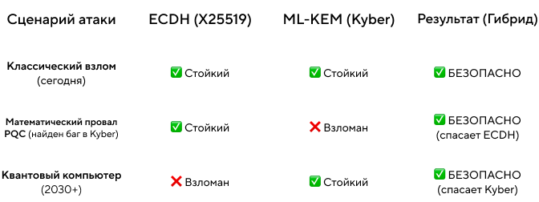

# Квантовый апокалипсис отменяется: гайд по переходу на Post-Quantum Cryptography (PQC)

Если ты пишешь бэкенд, фронтенд или мобилку — скорее всего, ты уже используешь шифрование. HTTPS, JWT, TLS — всё это работает на математике, которую квантовый компьютер сломает. Не сразу, но уже понятно когда.

Это не повод паниковать. Это повод разобраться — что именно сломается, что нет, и что нужно поменять в своём коде.

После этого материала ты будешь знать:

- Почему RSA и ECC обречены, а AES-256 — нет
- Что такое атака «собирай сейчас — читай потом» и затрагивает ли она твой сервис
- Какие новые алгоритмы пришли на замену и чем они отличаются друг от друга
- Почему переход на PQC может сломать соединения — и как этого избежать
- Как написать гибридную защиту, которая работает уже сегодня

## Оглавление

- [Что происходит и почему сейчас](#что-происходит-и-почему-сейчас)
- [История про Артёма — как выглядит атака](#история-про-артёма)
- [Почему одни алгоритмы сломаются, а другие нет](#почему-одни-алгоритмы-сломаются-а-другие-нет)
- [Новые алгоритмы: что выбрать и для чего](#новые-алгоритмы-что-выбрать-и-для-чего)
- [Подводные камни при внедрении](#подводные-камни-при-внедрении)
- [Как защититься уже сегодня: гибридный подход](#как-защититься-уже-сегодня-гибридный-подход)
- [Реальный кейс: как это сделал Signal](#реальный-кейс-как-это-сделал-signal)
- [Тест](#тест)
- [Задание: найди и исправь уязвимости в конфиге TLS](#задание-найди-и-исправь-уязвимости-в-конфиге-tls)

---

## Что происходит и почему сейчас

В августе 2024 года NIST (американский институт стандартов) опубликовал новые стандарты шифрования — специально разработанные против квантовых компьютеров. Apple уже защитила iMessage, Google обновил Chrome, Signal переписал протокол обмена ключами.

Квантового компьютера, который ломает шифрование, ещё нет. Но есть три причины начинать прямо сейчас:

**Причина 1: данные крадут уже сегодня.** Зашифрованный трафик можно перехватить и хранить — а расшифровать потом, когда появится нужный компьютер. Если твои данные должны быть секретными ещё лет через пять — они уже под угрозой.

**Причина 2: миграция занимает годы.** Обновить один сервис — легко. Обновить все сервисы, партнёрские интеграции, мобильные клиенты, IoT-устройства в поле — это большой проект.

**Причина 3: прогресс ускоряется.** В мае 2025 года вышла оптимизация алгоритма Шора, которая снизила требования к квантовому железу в 20 раз. Прогноз сдвинулся с «никогда» на начало 2030-х.

> **Коротко:** переход на PQC — это не «когда-нибудь». Это инфраструктурный проект, который нужно начинать сейчас.

---

## История про Артёма

Давай сначала посмотрим, как атака выглядит на практике. Это поможет понять, что именно мы защищаем.

### Знакомьтесь: Артём

Артём — аналитик данных в небольшой компании. Днём он строит графики в Excel и пьёт третий кофе, а по ночам… по ночам он работает над долгосрочным инвестиционным проектом.

Артём перехватывает корпоративный трафик крупного банка и аккуратно складывает его на жёсткий диск.

Он не спешит. У него есть план.

Коллеги называют его «самым терпеливым человеком в комнате». Артём только улыбается и запускает очередной дамп TLS-сессий в архив.

### Шаг 1. Сбор урожая

*Место действия: арендованный сервер. 2025 год.*

Артём настраивает перехват трафика через подконтрольный ему узел. Банк использует TLS 1.3 с RSA-2048 и ECDH на кривой P-256. Всё по учебнику. Всё надёжно.

— Сейчас — да, — бормочет Артём и запускает сниффер.

```
[CAPTURE] TLS session dump → archive_2025_01.enc  [4.2 GB]
[CAPTURE] TLS session dump → archive_2025_02.enc  [3.8 GB]
[CAPTURE] TLS session dump → archive_2025_03.enc  [5.1 GB]
...
```

Трафик зашифрован. Артём это знает. Его это не беспокоит.

> **Что происходит:** злоумышленник записывает TLS-сессии целиком — включая ClientHello и ServerHello с публичными ключами. Расшифровать сейчас невозможно, но сами байты никуда не деваются.

### Шаг 2. Холодное хранение

За месяц набирается ~60 ГБ: транзакции, внутренние API-вызовы, переписка систем.

```bash
> tar -czf archive_2025_01.enc.gz ./harvest/2025-01/*
> rclone copy archive_2025_01.enc.gz cold-storage:/bank_harvest/
> du -sh cold-storage:/bank_harvest/
61.4 GB    total
> echo "Стоимость хранения: 1.23 в месяц. Дешевле подписки на стриминг."
```

Артём закрывает ноутбук и идёт спать. Завтра — обычный рабочий день.

### Шаг 3. Ожидание: 2025 → 2031

Артём продолжает работать аналитиком. Читает новости о квантовых компьютерах. Следит за IBM и Google.

Однажды утром он видит заголовок:

> **«Google объявляет о первом CRQC: RSA-2048 взломан за 4 часа»**

Артём медленно допивает кофе и открывает терминал.

### Шаг 4. Час расплаты

*2031 год. Артём достаёт архивы шестилетней давности.*

```
> quantum_shor_client --algorithm ECDH-P256 --target archive_2025_01.enc
[INFO] Загружено 61400 TLS-сессий.
[INFO] Восстановление session key для сессии 2025-01-15 10:23:17...
[████████████████] 100%
[SUCCESS] Session key recovered: a3f9e4b7c812d5467f1a9b3c5d7e8f2a

> decrypt_tls_session --key a3f9e4b7c812d5467f1a9b3c5d7e8f2a --input harvest_20250115.enc
[SUCCESS] → decrypted_20250115.json

{
  "transaction_id": "TXN-20250115-009823",
  "from_account": "****4471",
  "to_account":   "****8832",
  "amount":        2850000,
  "currency":      "RUB",
  "auth_token":   "eyJhbGciOiJIUzI1NiIsInR5cCI6IkpXVCJ9..."
}
```

Шесть лет ожидания. Один скрипт. Полный архив транзакций.

— Терпение, — говорит он себе. — Терпение и труд всё перетрут.

### Что пошло не так?

Банк сделал три ошибки:

1. **Использовал ECDH P-256** — эллиптические кривые уязвимы для алгоритма Шора. Ключ короткий, кубитов нужно меньше — ECC ломается первой (об этом дальше).
2. **Не внедрил гибридный обмен ключами** — если бы рядом с ECDH работал ML-KEM (Kyber), Артёму понадобился бы и квантовый компьютер, и уязвимость в Kyber одновременно.
3. **Откладывал миграцию** — данные были украдены раньше, чем угроза стала реальной.

**Мог ли Артём потерпеть неудачу?** Да. Достаточно было одной строки в конфиге — гибридный обмен ключами:

```
MasterSecret = KDF(SharedSecret_ECDH || SharedSecret_Kyber)
```

Даже взломав ECDH квантовым компьютером, Артём получил бы только половину входных данных для финального ключа. Без Kyber-части — ничего.

---

_## Теорема Моска: когда именно горит?

Исследователь Микеле Моска сформулировал простое правило риска:


Вот калькулятор для самопроверки:

```java
import java.time.Year;
import java.util.HashMap;
import java.util.Map;

public class QuantumRiskCalculator {
    
    // Константа: консервативный прогноз появления CRQC
    private static final int YEAR_CRQC_ARRIVAL = 2032;
    
    /**
     * Проверяет, успеваешь ли ты с миграцией.
     * @param dataType описание типа данных
     * @param shelfLifeYears X — сколько лет данные должны быть секретны
     * @param migrationEstimateYears Y — сколько займёт внедрение PQC
     */
    public static void checkQuantumRisk(String dataType, int shelfLifeYears, int migrationEstimateYears) {
        int currentYear = Year.now().getValue();
        int z = YEAR_CRQC_ARRIVAL - currentYear; // сколько лет осталось
        int total = shelfLifeYears + migrationEstimateYears;
        
        System.out.println("\n--- " + dataType + " ---");
        if (total > z) {
            System.out.printf("🔴 РИСК. Ты опаздываешь на %d лет.%n", total - z);
        } else {
            System.out.printf("🟢 Запас: %d лет.%n", z - total);
        }
    }
    
    public static void main(String[] args) {
        // Попробуй со своими данными:
        checkQuantumRisk("Сессионные токены (живут 24ч)", 0, 2);
        checkQuantumRisk("История транзакций (храним 7 лет)", 7, 3);
        checkQuantumRisk("Медицинские данные (бессрочно)", 20, 4);
        
        // Добавим интерактивный режим для удобства
        runInteractiveMode();
    }
    
    /**
     * Интерактивный режим для проверки собственных параметров
     */
    private static void runInteractiveMode() {
        System.out.println("\n=== Интерактивный режим ===");
        System.out.println("Введите параметры для проверки (или 'exit' для выхода):");
        
        Map<String, int[]> testCases = new HashMap<>();
        testCases.put("Сессионные токены", new int[]{0, 2});
        testCases.put("История транзакций", new int[]{7, 3});
        testCases.put("Медицинские данные", new int[]{20, 4});
        
        for (Map.Entry<String, int[]> entry : testCases.entrySet()) {
            checkQuantumRisk(entry.getKey(), entry.getValue()[0], entry.getValue()[1]);
        }
    }
}
```

Запусти это с параметрами своего сервиса — и сразу поймёшь, насколько срочно.

---

## Почему одни алгоритмы сломаются, а другие нет

### RSA и ECC: почему они обречены

Вся асимметричная криптография держится на «задачах с потайным ходом» — математике, которую легко решить в одну сторону и почти невозможно в обратную.

- **RSA** — на факторизации: перемножить два простых числа легко, разложить обратно — нет.
- **ECC и ECDH** — на дискретном логарифмировании в группе точек эллиптической кривой.

Алгоритм Шора (1994) умеет находить период функции за полиномиальное время — и обе задачи становятся тривиальными для квантового компьютера.

**Неочевидный факт про ECC:** мы привыкли считать его «надёжнее» RSA — ключ ECC-256 по классической стойкости эквивалентен RSA-3072, но компактнее. В квантовом мире компактность оборачивается уязвимостью: короткий ключ требует меньше кубитов для взлома.

| Алгоритм | Логических кубитов для взлома |
|---|---|
| RSA-2048 | ~4098 |
| ECDSA-256 | ~2330 |

Эллиптические кривые, скорее всего, падут **раньше** RSA — раньше, чем у атакующих хватит мощности на «старый добрый» RSA. Это контринтуитивно, но важно.


### Симметрия держит удар

AES не имеет математической периодичности, на которой работает алгоритм Шора. Здесь применяется другой квантовый алгоритм — Гровера, который даёт квадратичное ускорение перебора:

- AES-128 → эффективные **64 бита** — слабовато
- AES-256 → эффективные **128 бит** — по-прежнему надёжно ✅

### Практическое задание: Калькулятор квантовой стойкости на Java
Давайте напишем скрипт, который наглядно покажет, почему мы отказываемся от ECC, но оставляем AES.

```java
import java.util.Scanner;

public class QuantumSecurityCalculatorEnhanced {
    
    private static final int SAFE_THRESHOLD = 128;
    
    public static void main(String[] args) {
        Scanner scanner = new Scanner(System.in);
        
        System.out.println("=== Калькулятор квантовой стойкости ===");
        System.out.println("Оцени эффективную стойкость алгоритмов против квантовых атак\n");
        
        while (true) {
            printMenu();
            System.out.print("Выберите алгоритм (1-4, 0 для выхода): ");
            
            String choice = scanner.nextLine();
            if (choice.equals("0")) {
                System.out.println("Выход из программы. Защищай данные квантово-безопасно!");
                break;
            }
            
            processChoice(choice, scanner);
            System.out.println();
        }
        
        scanner.close();
    }
    
    private static void printMenu() {
        System.out.println("Доступные алгоритмы:");
        System.out.println("1. RSA (асимметричный)");
        System.out.println("2. ECC (эллиптическая криптография)");
        System.out.println("3. SYMMETRIC (симметричный, например AES)");
        System.out.println("4. Сравнить все алгоритмы");
        System.out.println("0. Выход");
    }
    
    private static void processChoice(String choice, Scanner scanner) {
        switch (choice) {
            case "1":
                testRSA(scanner);
                break;
            case "2":
                testECC(scanner);
                break;
            case "3":
                testSymmetric(scanner);
                break;
            case "4":
                compareAll();
                break;
            default:
                System.out.println("Неверный выбор. Попробуйте снова.");
        }
    }
    
    private static void testRSA(Scanner scanner) {
        System.out.print("Введите размер ключа RSA (бит): ");
        int keySize = Integer.parseInt(scanner.nextLine());
        calculateQuantumSecurity("RSA", keySize);
        explainQuantumThreat("RSA");
    }
    
    private static void testECC(Scanner scanner) {
        System.out.print("Введите размер ключа ECC (бит): ");
        int keySize = Integer.parseInt(scanner.nextLine());
        calculateQuantumSecurity("ECC", keySize);
        explainQuantumThreat("ECC");
    }
    
    private static void testSymmetric(Scanner scanner) {
        System.out.print("Введите размер ключа симметричного алгоритма (бит): ");
        int keySize = Integer.parseInt(scanner.nextLine());
        calculateQuantumSecurity("SYMMETRIC", keySize);
        explainQuantumThreat("SYMMETRIC");
    }
    
    private static void compareAll() {
        System.out.println("\n📊 Сравнение алгоритмов при одинаковом размере ключа (256 бит):");
        calculateQuantumSecurity("RSA", 256);
        calculateQuantumSecurity("ECC", 256);
        calculateQuantumSecurity("SYMMETRIC", 256);
        
        System.out.println("\n📈 Влияние размера ключа на симметричную криптографию:");
        for (int size : new int[]{64, 128, 192, 256, 512}) {
            calculateQuantumSecurity("SYMMETRIC", size);
        }
    }
    
    public static void calculateQuantumSecurity(String algorithmType, int keySizeBits) {
        String alg = algorithmType.toUpperCase();
        int effectiveBits;
        String verdict;
        String quantumAttack;
        
        switch (alg) {
            case "RSA":
            case "ECC":
                effectiveBits = 0;
                quantumAttack = "алгоритм Шора";
                break;
                
            case "SYMMETRIC":
                effectiveBits = keySizeBits / 2;
                quantumAttack = "алгоритм Гровера";
                break;
                
            default:
                System.out.println("Неизвестный алгоритм");
                return;
        }
        
        if (effectiveBits >= SAFE_THRESHOLD) {
            verdict = "✅ БЕЗОПАСНО";
        } else if (effectiveBits > 0) {
            verdict = "⚠️ ОСЛАБЛЕНО — обновись до более длинного ключа";
        } else {
            verdict = "💀 ВЗЛОМАНО — срочно мигрируй на PQC";
        }
        
        System.out.printf("%s-%d: %d эффективных бит → %s%n", 
                         alg, keySizeBits, effectiveBits, verdict);
    }
    
    private static void explainQuantumThreat(String algorithm) {
        switch (algorithm.toUpperCase()) {
            case "RSA":
                System.out.println("  📌 RSA основан на факторизации → квантовый компьютер " +
                                 "ломает его полностью алгоритмом Шора");
                break;
            case "ECC":
                System.out.println("  📌 ECC основан на дискретном логарифме → та же уязвимость " +
                                 "к алгоритму Шора");
                break;
            case "SYMMETRIC":
                System.out.println("  📌 Симметричная криптография страдает меньше: " +
                                 "алгоритм Гровера даёт только квадратичное ускорение");
                break;
        }
    }
    
    /**
     * Демонстрация практических рекомендаций
     */
    public static void printRecommendations() {
        System.out.println("\n=== Практические рекомендации ===");
        System.out.println("Асимметричная криптография (RSA/ECC):");
        System.out.println("  ❌ НЕ ИСПОЛЬЗОВАТЬ для долгосрочных данных");
        System.out.println("  🔄 Мигрируй на пост-квантовые алгоритмы (CRYSTALS-Kyber, etc.)");
        System.out.println("\nСимметричная криптография (AES):");
        System.out.println("  ✅ AES-256 остаётся безопасным (128 эффективных бит)");
        System.out.println("  ⚠️ AES-128 даёт только 64 бита защиты — пограничный случай");
        System.out.println("  📈 Рекомендуется использовать AES-256 для новых систем");
    }
}
```

---

## Новые алгоритмы: что выбрать и для чего

### ML-KEM (бывший Kyber) — FIPS 203

**Для чего:** замена ECDH при обмене ключами в TLS, API, защищённых каналах.

**Основа:** модульные решётки — математические задачи, которые квантовый компьютер не умеет решать быстро.

**Главное отличие от ECDH:** в ECDH обе стороны независимо вычисляют один и тот же секрет. В KEM (Key Encapsulation Mechanism) работает иначе — как конверт с посылкой:

```
import java.security.*;
import java.security.spec.*;
import javax.crypto.KeyAgreement;
import java.util.Arrays;
import java.util.Base64;
import java.util.HashMap;
import java.util.Map;

/**
 * Демонстрация различий между классическим ECDH и пост-квантовым ML-KEM (KEM)
 * 
 * ECDH: обе стороны независимо вычисляют общий секрет
 * ML-KEM: одна сторона запечатывает секрет, другая распечатывает (как конверт с посылкой)
 */
public class KEMvsECDHDemo {
    
    private static final Base64.Encoder encoder = Base64.getEncoder();
    private static final int KEY_LENGTH = 32; // 256 бит для демо
    
    /**
     * Результат выполнения протокола
     */
    public static class ProtocolResult {
        private final String protocol;
        private final String[] steps;
        private final String clientSecret;
        private final String serverSecret;
        private final boolean match;
        private final String ciphertext;
        
        public ProtocolResult(String protocol, String[] steps, String clientSecret, 
                             String serverSecret, boolean match, String ciphertext) {
            this.protocol = protocol;
            this.steps = steps;
            this.clientSecret = clientSecret;
            this.serverSecret = serverSecret;
            this.match = match;
            this.ciphertext = ciphertext;
        }
        
        public String getProtocol() { return protocol; }
        public String[] getSteps() { return steps; }
        public String getClientSecret() { return clientSecret; }
        public String getServerSecret() { return serverSecret; }
        public boolean isMatch() { return match; }
        public String getCiphertext() { return ciphertext; }
        
        public void printSteps() {
            for (String step : steps) {
                System.out.println(step);
            }
        }
    }
    
    /**
     * Демонстрация классического ECDH
     */
    public ProtocolResult demonstrateECDH() throws Exception {
        java.util.List<String> stepsList = new java.util.ArrayList<>();
        
        stepsList.add("=== Классический ECDH ===");
        stepsList.add("Обе стороны обмениваются публичными ключами и независимо считают общий секрет\n");
        
        // Генерация ключевых пар
        KeyPairGenerator keyPairGen = KeyPairGenerator.getInstance("EC");
        keyPairGen.initialize(256); // Используем кривую secp256r1
        
        stepsList.add("1. Клиент генерирует ключевую пару:");
        KeyPair clientKeyPair = keyPairGen.generateKeyPair();
        byte[] clientPubEncoded = clientKeyPair.getPublic().getEncoded();
        stepsList.add("   Публичный ключ клиента: " + truncate(encoder.encodeToString(clientPubEncoded)));
        
        stepsList.add("\n2. Сервер генерирует ключевую пару:");
        KeyPair serverKeyPair = keyPairGen.generateKeyPair();
        byte[] serverPubEncoded = serverKeyPair.getPublic().getEncoded();
        stepsList.add("   Публичный ключ сервера: " + truncate(encoder.encodeToString(serverPubEncoded)));
        
        stepsList.add("\n3. Стороны обмениваются публичными ключами");
        
        // Вычисление общих секретов
        byte[] clientShared = computeECDHSecret(clientKeyPair.getPrivate(), serverKeyPair.getPublic());
        byte[] serverShared = computeECDHSecret(serverKeyPair.getPrivate(), clientKeyPair.getPublic());
        
        String clientSecretHex = bytesToHex(clientShared);
        String serverSecretHex = bytesToHex(serverShared);
        
        stepsList.add("\n4. Результат:");
        stepsList.add("   Секрет клиента: " + truncate(clientSecretHex));
        stepsList.add("   Секрет сервера: " + truncate(serverSecretHex));
        
        boolean match = MessageDigest.isEqual(clientShared, serverShared);
        stepsList.add("   Совпадают? " + (match ? "✓ ДА" : "✗ НЕТ"));
        
        return new ProtocolResult(
            "ECDH",
            stepsList.toArray(new String[0]),
            clientSecretHex,
            serverSecretHex,
            match,
            ""
        );
    }
    
    /**
     * Вычисление ECDH секрета
     */
    private byte[] computeECDHSecret(PrivateKey privateKey, PublicKey publicKey) throws Exception {
        KeyAgreement keyAgreement = KeyAgreement.getInstance("ECDH");
        keyAgreement.init(privateKey);
        keyAgreement.doPhase(publicKey, true);
        return keyAgreement.generateSecret();
    }
    
    /**
     * Демонстрация ML-KEM
     */
    public ProtocolResult demonstrateMLKEM() {
        java.util.List<String> stepsList = new java.util.ArrayList<>();
        
        stepsList.add("=== ML-KEM (Key Encapsulation Mechanism) ===");
        stepsList.add("Клиент создаёт конверт (публичный ключ), сервер запечатывает секрет\n");
        
        // Клиент генерирует ключевую пару
        stepsList.add("1. Клиент генерирует ключевую пару ML-KEM:");
        MLKEMKeyPair clientKeyPair = MLKEM.keygen();
        String clientPubStr = truncate(encoder.encodeToString(clientKeyPair.getPublicKey().getEncoded()));
        stepsList.add("   Публичный ключ клиента (конверт): " + clientPubStr);
        stepsList.add("   Приватный ключ клиента хранится в секрете");
        
        stepsList.add("\n2. Клиент отправляет публичный ключ серверу");
        
        // Сервер запечатывает секрет
        stepsList.add("\n3. Сервер запечатывает (encaps) секрет в публичный ключ клиента:");
        MLKEMEncapsulationResult serverResult = MLKEM.encaps(clientKeyPair.getPublicKey());
        byte[] ciphertext = serverResult.getCiphertext();
        byte[] serverShared = serverResult.getSharedSecret();
        
        stepsList.add("   Сгенерированный шифротекст: " + truncate(encoder.encodeToString(ciphertext)));
        stepsList.add("   Общий секрет сервера: " + truncate(encoder.encodeToString(serverShared)));
        
        stepsList.add("\n4. Сервер отправляет шифротекст клиенту");
        
        // Клиент распечатывает секрет
        stepsList.add("\n5. Клиент распечатывает (decaps) шифротекст своим приватным ключом:");
        byte[] clientShared = MLKEM.decaps(ciphertext, clientKeyPair.getPrivateKey());
        stepsList.add("   Общий секрет клиента: " + truncate(encoder.encodeToString(clientShared)));
        
        stepsList.add("\n6. Результат:");
        stepsList.add("   Секрет сервера: " + truncate(encoder.encodeToString(serverShared)));
        stepsList.add("   Секрет клиента: " + truncate(encoder.encodeToString(clientShared)));
        
        boolean match = MessageDigest.isEqual(serverShared, clientShared);
        stepsList.add("   Совпадают? " + (match ? "✓ ДА" : "✗ НЕТ"));
        
        return new ProtocolResult(
            "ML-KEM",
            stepsList.toArray(new String[0]),
            bytesToHex(clientShared),
            bytesToHex(serverShared),
            match,
            bytesToHex(ciphertext)
        );
    }
    
    /**
     * Сравнение двух подходов
     */
    public Map<String, String[]> compareProtocols() {
        Map<String, String[]> comparison = new HashMap<>();
        
        comparison.put("features", new String[]{
            "Роль сторон",
            "Обмен сообщениями",
            "Кто создаёт секрет",
            "Квантовая стойкость",
            "Количество передач",
            "Пост-квантовая готовность"
        });
        
        comparison.put("ECDH", new String[]{
            "Равноправные",
            "2 сообщения (pub-key → pub-key)",
            "Обе стороны независимо",
            "❌ Уязвим (алгоритм Шора)",
            "2",
            "❌ Нет"
        });
        
        comparison.put("ML-KEM", new String[]{
            "Клиент (получатель), Сервер (отправитель)",
            "2 сообщения (pub-key → ciphertext)",
            "Сервер создаёт, клиент извлекает",
            "✅ Устойчив (пост-квантовый)",
            "2",
            "✅ Да (NIST стандарт)"
        });
        
        return comparison;
    }
    
    /**
     * Вспомогательные методы
     */
    private String truncate(String str) {
        if (str == null || str.length() <= 16) return str;
        return str.substring(0, 8) + "..." + str.substring(str.length() - 8);
    }
    
    private String bytesToHex(byte[] bytes) {
        StringBuilder sb = new StringBuilder();
        for (byte b : bytes) {
            sb.append(String.format("%02x", b));
        }
        return sb.toString();
    }
    
    /**
     * Главный метод для демонстрации
     */
    public static void main(String[] args) {
        try {
            KEMvsECDHDemo demo = new KEMvsECDHDemo();
            
            System.out.println("🔄 Сравнение ECDH и ML-KEM\n");
            
            // Демонстрация ECDH
            ProtocolResult ecdh = demo.demonstrateECDH();
            ecdh.printSteps();
            
            System.out.println();
            
            // Демонстрация ML-KEM
            ProtocolResult mlkem = demo.demonstrateMLKEM();
            mlkem.printSteps();
            
            System.out.println();
            
            // Сравнение
            System.out.println("=== Сравнение ECDH и ML-KEM ===");
            System.out.println(String.join("", java.util.Collections.nCopies(80, "-")));
            
            Map<String, String[]> comparison = demo.compareProtocols();
            String[] features = comparison.get("features");
            String[] ecdhVals = comparison.get("ECDH");
            String[] mlkemVals = comparison.get("ML-KEM");
            
            System.out.printf("%-25s %-25s %-25s%n", "Характеристика", "ECDH", "ML-KEM");
            System.out.println(String.join("", java.util.Collections.nCopies(80, "-")));
            
            for (int i = 0; i < features.length; i++) {
                System.out.printf("%-25s %-25s %-25s%n", 
                    features[i], ecdhVals[i], mlkemVals[i]);
            }
            
            System.out.println(String.join("", java.util.Collections.nCopies(80, "-")));
            
            System.out.println("\n🔑 Главное отличие: в ECDH обе стороны вычисляют секрет (взаимный обмен),");
            System.out.println("   в KEM одна сторона запечатывает секрет, другая распечатывает (как конверт с посылкой)");
            
        } catch (Exception e) {
            System.err.println("Ошибка: " + e.getMessage());
            e.printStackTrace();
        }
    }
    
    // ==================== Имитация ML-KEM для демонстрации ====================
    
    /**
     * Имитация ML-KEM ключей
     */
    static class MLKEMKey {
        private final byte[] encoded;
        
        public MLKEMKey(byte[] encoded) {
            this.encoded = encoded.clone();
        }
        
        public byte[] getEncoded() {
            return encoded.clone();
        }
    }
    
    static class MLKEMPublicKey extends MLKEMKey {
        public MLKEMPublicKey(byte[] encoded) {
            super(encoded);
        }
    }
    
    static class MLKEMPrivateKey extends MLKEMKey {
        public MLKEMPrivateKey(byte[] encoded) {
            super(encoded);
        }
    }
    
    static class MLKEMKeyPair {
        private final MLKEMPublicKey publicKey;
        private final MLKEMPrivateKey privateKey;
        
        public MLKEMKeyPair(MLKEMPublicKey publicKey, MLKEMPrivateKey privateKey) {
            this.publicKey = publicKey;
            this.privateKey = privateKey;
        }
        
        public MLKEMPublicKey getPublicKey() { return publicKey; }
        public MLKEMPrivateKey getPrivateKey() { return privateKey; }
    }
    
    static class MLKEMEncapsulationResult {
        private final byte[] ciphertext;
        private final byte[] sharedSecret;
        
        public MLKEMEncapsulationResult(byte[] ciphertext, byte[] sharedSecret) {
            this.ciphertext = ciphertext.clone();
            this.sharedSecret = sharedSecret.clone();
        }
        
        public byte[] getCiphertext() { return ciphertext.clone(); }
        public byte[] getSharedSecret() { return sharedSecret.clone(); }
    }
    
    /**
     * Имитация ML-KEM (для демонстрации концепции)
     */
    static class MLKEM {
        private static final SecureRandom random = new SecureRandom();
        
        public static MLKEMKeyPair keygen() {
            byte[] publicKey = new byte[32 * 2]; // ML-KEM ключи больше
            byte[] privateKey = new byte[32 * 3];
            random.nextBytes(publicKey);
            random.nextBytes(privateKey);
            
            return new MLKEMKeyPair(
                new MLKEMPublicKey(publicKey),
                new MLKEMPrivateKey(privateKey)
            );
        }
        
        public static MLKEMEncapsulationResult encaps(MLKEMPublicKey publicKey) {
            // Генерируем случайный общий секрет
            byte[] sharedSecret = new byte[32];
            random.nextBytes(sharedSecret);
            
            // Создаём шифротекст (имитация)
            byte[] ciphertext = new byte[32];
            random.nextBytes(ciphertext);
            
            return new MLKEMEncapsulationResult(ciphertext, sharedSecret);
        }
        
        public static byte[] decaps(byte[] ciphertext, MLKEMPrivateKey privateKey) {
            // В реальности: расшифровываем ciphertext с помощью privateKey
            // Для демо: возвращаем детерминированный результат
            byte[] result = new byte[32];
            try {
                MessageDigest md = MessageDigest.getInstance("SHA-256");
                byte[] input = Arrays.copyOf(ciphertext, ciphertext.length + privateKey.getEncoded().length);
                System.arraycopy(privateKey.getEncoded(), 0, input, ciphertext.length, privateKey.getEncoded().length);
                return md.digest(input);
            } catch (NoSuchAlgorithmException e) {
                random.nextBytes(result);
                return result;
            }
        }
    }
}
```

Kyber на современном процессоре работает **быстрее** X25519. Платишь не временем CPU, а размером данных — ключ 1184 байта вместо 32.

### ML-DSA (бывший Dilithium) — FIPS 204

**Для чего:** цифровые подписи — сертификаты, JWT, подпись API-ответов, авторизация.

**Когда выбирать:** если нужна быстрая проверка подписи. Браузер проверяет цепочки сертификатов за миллисекунды — ML-DSA справляется. Минус — подпись весит ~3300 байт вместо 64 у ECDSA.

### SLH-DSA (бывший SPHINCS+) — FIPS 205

**Для чего:** подпись прошивок, корневые сертификаты, долгоживущие ключи.

**Когда выбирать:** когда надёжность важнее скорости и размера, а проверка подписи редкая. SLH-DSA основан на хеш-функциях, а не на решётках — если в теории решёток найдут уязвимость, он выстоит. Подпись весит 8–40 КБ.

### HQC — резервный KEM

Основан на теории кодирования, математически независим от решёток. Медленнее Kyber и тяжелее, но это запасной парашют: если в Kyber найдут дыру — HQC не затронет.

### Итоговая таблица: что куда

| Задача | Старый алгоритм | Новый алгоритм |
|---|---|---|
| Обмен ключами в TLS/API | ECDH (X25519) | ML-KEM (Kyber) |
| Подпись JWT, сертификаты | ECDSA, RSA | ML-DSA (Dilithium) |
| Подпись прошивок, root CA | RSA-4096 | SLH-DSA (SPHINCS+) |
| Резерв на случай взлома решёток | — | HQC |

---

## Подводные камни при внедрении

### Проблема 1: новые ключи не влезают в пакеты

Ключ X25519 — 32 байта. Ключ ML-KEM-768 — 1184 байта. Разница в 37 раз.

Стандартный MTU большинства сетей — **1500 байт**. Классический `ClientHello` в TLS занимает 300–500 байт. После добавления Kyber он вырастает примерно до 1600–1800 байт и перестаёт влезать в один пакет.

Что происходит:

1. TCP разбивает `ClientHello` на несколько пакетов — сервер ждёт все.
2. На нестабильных мобильных сетях это добавляет 20–40% ко времени установки соединения.
3. **Главная ловушка — Middlebox Ossification:** старые корпоративные файрволы и DPI-системы не распознают фрагментированный `ClientHello` как легитимный TLS и просто дропают пакет. По данным Cloudflare и Google, ~1–2% соединений в интернете ломаются именно из-за этого.

```
import java.util.Arrays;

public class TLSFragmentationSimulator {
    
    /**
     * Класс, моделирующий сетевой путь с MTU и возможностью дропа фрагментированных пакетов
     */
    static class NetworkPath {
        private final int mtu;
        private final boolean dropFragmented; // true = старый корпоративный файрвол
        
        public NetworkPath(int mtu, boolean dropFragmented) {
            this.mtu = mtu;
            this.dropFragmented = dropFragmented;
        }
        
        /**
         * Трансмиссия данных через сетевой путь
         * @param dataBytes данные для отправки
         * @return true если пакет успешно доставлен, false если дропнут
         */
        public boolean transmit(byte[] dataBytes) {
            int packetSize = dataBytes.length;
            int effectiveMtu = mtu - 40; // вычитаем IP(20) + TCP(20) заголовки
            
            if (packetSize <= effectiveMtu) {
                System.out.printf("✅ Пакет %dб прошёл целиком.%n", packetSize);
                return true;
            }
            
            int fragments = (int) Math.ceil((double) packetSize / effectiveMtu);
            System.out.printf("⚠️  Пакет %dб > MTU. Разбито на %d фрагмента(ов).%n", 
                            packetSize, fragments);
            
            if (dropFragmented) {
                // Вот здесь у пользователя зависает загрузка страницы
                System.out.println("🚫 Старый файрвол дропнул соединение (Middlebox Ossification).");
                return false;
            }
            
            System.out.println("✅ Фрагменты доставлены (но latency вырос).");
            return true;
        }
    }
    
    /**
     * Демонстрация различных сценариев фрагментации TLS пакетов
     */
    public static void demonstrateFragmentation() {
        // Обычный ClientHello (~400 байт)
        byte[] classicHello = new byte[400];
        Arrays.fill(classicHello, (byte) 0);
        
        // ClientHello с гибридным Kyber-768 (~1700 байт)
        byte[] pqcHello = new byte[1700];
        Arrays.fill(pqcHello, (byte) 0);
        
        System.out.println("=== Анализ TLS Handshake с разными типами сетей ===\n");
        
        // Сценарий 1: Современный роутер
        System.out.println("📡 Сценарий 1: Современный роутер (MTU=1500, без дропа)");
        NetworkPath modernRouter = new NetworkPath(1500, false);
        
        System.out.println("\n--- Classic TLS 1.3 ---");
        modernRouter.transmit(classicHello);
        
        System.out.println("\n--- TLS с PQC (Kyber-768) ---");
        modernRouter.transmit(pqcHello);
        
        // Сценарий 2: Корпоративный legacy firewall
        System.out.println("\n🏢 Сценарий 2: Корпоративный Legacy Firewall (MTU=1500, дроп фрагментов)");
        NetworkPath legacyFirewall = new NetworkPath(1500, true);
        
        System.out.println("\n--- Classic TLS 1.3 ---");
        legacyFirewall.transmit(classicHello);
        
        System.out.println("\n--- TLS с PQC (Kyber-768) ---");
        legacyFirewall.transmit(pqcHello);
    }
    
    /**
     * Статистический анализ проблемы на основе данных Cloudflare/Google
     */
    public static void analyzeProblemScale() {
        System.out.println("\n=== Масштаб проблемы (по данным Cloudflare и Google) ===");
        System.out.println("Статистика по Middlebox Ossification:");
        System.out.println("  • ~1-2% всех TLS соединений в интернете ломаются");
        System.out.println("  • Фрагментированные ClientHello дропаются старыми файрволами");
        System.out.println("  • Проблема усугубляется с внедрением PQC (большие ключи)\n");
        
        // Симуляция статистики
        simulateConnectionStats(10000);
    }
    
    /**
     * Симуляция статистики соединений
     */
    private static void simulateConnectionStats(int totalConnections) {
        double failureRate = 0.015; // 1.5% согласно данным
        int failedConnections = (int) (totalConnections * failureRate);
        int successfulConnections = totalConnections - failedConnections;
        
        System.out.printf("Симуляция на %d соединениях:%n", totalConnections);
        System.out.printf("  ✅ Успешных: %d (%.1f%%)%n", 
                         successfulConnections, 
                         (successfulConnections * 100.0 / totalConnections));
        System.out.printf("  ❌ Сломано из-за фрагментации: %d (%.1f%%)%n", 
                         failedConnections, 
                         (failedConnections * 100.0 / totalConnections));
    }
    
    /**
     * Интерактивный режим для тестирования разных параметров
     */
    public static void interactiveMode() {
        java.util.Scanner scanner = new java.util.Scanner(System.in);
        
        System.out.println("\n=== Интерактивный режим тестирования ===");
        System.out.println("Настройте параметры сети и проверьте влияние на TLS соединения:\n");
        
        try {
            System.out.print("Введите MTU (по умолчанию 1500): ");
            int mtu = Integer.parseInt(scanner.nextLine());
            
            System.out.print("Размер ClientHello в байтах (400 для классического, 1700 для PQC): ");
            int packetSize = Integer.parseInt(scanner.nextLine());
            
            System.out.print("Дропать фрагментированные пакеты? (true/false): ");
            boolean dropFragmented = Boolean.parseBoolean(scanner.nextLine());
            
            // Создаем тестовый пакет
            byte[] testPacket = new byte[packetSize];
            Arrays.fill(testPacket, (byte) 0);
            
            NetworkPath path = new NetworkPath(mtu, dropFragmented);
            System.out.println("\n📤 Результат передачи:");
            boolean result = path.transmit(testPacket);
            
            System.out.println(result ? 
                "✅ Соединение установлено успешно" : 
                "❌ Соединение заблокировано (TLS handshake failed)");
            
            if (!result && dropFragmented && packetSize > (mtu - 40)) {
                System.out.println("\n💡 Диагноз: Middlebox Ossification!");
                System.out.println("    Старый файрвол не распознал фрагментированный ClientHello");
                System.out.println("    Решение: Использовать TLS над TCP с поддержкой фрагментации");
            }
            
        } catch (NumberFormatException e) {
            System.out.println("Ошибка ввода: " + e.getMessage());
        } finally {
            scanner.close();
        }
    }
    
    /**
     * Демонстрация влияния PQC на размер handshake
     */
    public static void demonstratePQCSizeImpact() {
        System.out.println("\n=== Влияние PQC на размер TLS Handshake ===");
        
        // Размеры ключей разных алгоритмов (в байтах)
        int rsa2048Key = 256;      // 2048 бит = 256 байт
        int ecdsa256Key = 64;      // 256 бит = 64 байта
        int kyber768Key = 1184;    // Kyber-768 публичный ключ
        int dilithiumKey = 1952;   // Dilithium подпись
        
        System.out.println("\nРазмеры публичных ключей:");
        System.out.printf("  RSA-2048:        %5d байт ✅ (помещается в MTU)%n", rsa2048Key);
        System.out.printf("  ECDSA-256:       %5d байт ✅ (помещается в MTU)%n", ecdsa256Key);
        System.out.printf("  Kyber-768:       %5d байт ⚠️  (требует фрагментации)%n", kyber768Key);
        System.out.printf("  Dilithium:       %5d байт ⚠️  (требует фрагментации)%n", dilithiumKey);
        
        System.out.println("\nТипичный размер ClientHello:");
        System.out.println("  TLS 1.3 классический:      ~400 байт ✅");
        System.out.println("  TLS 1.3 + Kyber-768:      ~1700 байт ⚠️");
        System.out.println("  TLS 1.3 + полный PQC:     ~3000+ байт ❌");
    }
    
    public static void main(String[] args) {
        System.out.println("🔒 Симулятор TLS фрагментации и Middlebox Ossification\n");
        System.out.println("Что происходит при TLS Handshake:");
        System.out.println("1. TCP разбивает ClientHello на несколько пакетов — сервер ждёт все");
        System.out.println("2. На нестабильных мобильных сетях это добавляет 20–40% ко времени");
        System.out.println("3. Middlebox Ossification: старые файрволы дропают фрагменты\n");
        
        // Запуск демонстрации
        demonstrateFragmentation();
        analyzeProblemScale();
        demonstratePQCSizeImpact();
        
        // Раскомментируйте для интерактивного режима:
        // interactiveMode();
        
        System.out.println("\n📊 Выводы:");
        System.out.println("• PQC увеличивает размер ClientHello в 4-5 раз");
        System.out.println("• 1-2% пользователей не могут соединиться из-за старых файрволов");
        System.out.println("• Решения: EDNS(0), TCP без фрагментации, QUIC");
    }
}
```

### Проблема 2: CPU быстро, сеть медленно

Kyber на современном процессоре работает быстрее X25519 — матричные операции и хеширование CPU любит больше, чем математику эллиптических кривых.

Но ты выигрываешь микросекунды на CPU и теряешь миллисекунды на передаче лишних килобайтов. Для сервера в дата-центре разница незаметна. Для IoT-устройства на слабом канале — это батарея, которая кончается раньше.

---

## Как защититься уже сегодня: гибридный подход

### Зачем гибрид, а не просто «переключиться на Kyber»?

Решётки изучаются 20–30 лет, тогда как факторизация — столетиями. Kyber может содержать математическую ошибку, которую ещё не нашли. Если переключиться только на него — а потом найдут баг — потеряем всё.

Решение: использовать оба алгоритма одновременно, «ремень и подтяжки»:

```
MasterSecret = KDF(SharedSecret_ECDH || SharedSecret_Kyber)
```

Чтобы взломать это соединение, атакующему нужно одновременно:
- Иметь квантовый компьютер (чтобы взломать ECDH), **И**
- Знать математическую уязвимость в Kyber.

Это нетривиальное требование. Apple, Google и Signal выбрали именно этот подход.

### Схема TLS-рукопожатия с гибридным обменом


Клиент генерирует два keypair — классический X25519 и постквантовый ML-KEM — и отправляет оба публичных ключа в `ClientHello`. Сервер вычисляет классический ECDH-секрет и инкапсулирует PQC-секрет. Финальный мастер-ключ получается из обоих через KDF.

### Матрица безопасности гибридного подхода



### Практическое задание: Реализация гибридного KDF

Давайте смоделируем логику гибридного вывода ключей.

```
import javax.crypto.Mac;
import javax.crypto.spec.SecretKeySpec;
import java.security.MessageDigest;
import java.security.NoSuchAlgorithmException;
import java.security.SecureRandom;
import java.util.Arrays;
import java.util.HexFormat;

public class HybridKeyDerivation {
    
    private static final String HMAC_ALGORITHM = "HmacSHA256";
    private static final String HASH_ALGORITHM = "SHA-256";
    private static final int KEY_LENGTH = 32; // 256 бит
    
    /**
     * Упрощённый HKDF-Extract (RFC 5869).
     * Смешивает несколько секретов в один надёжный ключ.
     * В реальном коде используй полный HKDF из библиотеки Bouncy Castle.
     * 
     * @param salt соль (может быть null)
     * @param inputKeyMaterial входной ключевой материал
     * @return псевдослучайный ключ
     */
    public static byte[] hkdfExtract(byte[] salt, byte[] inputKeyMaterial) {
        try {
            if (salt == null) {
                // Нулевая соль по RFC: массив нулей размером с хеш
                salt = new byte[MessageDigest.getInstance(HASH_ALGORITHM).getDigestLength()];
                // Уже заполнен нулями по умолчанию
            }
            
            Mac mac = Mac.getInstance(HMAC_ALGORITHM);
            SecretKeySpec keySpec = new SecretKeySpec(salt, HMAC_ALGORITHM);
            mac.init(keySpec);
            return mac.doFinal(inputKeyMaterial);
            
        } catch (Exception e) {
            throw new RuntimeException("Ошибка HKDF-Extract: " + e.getMessage(), e);
        }
    }
    
    /**
     * Финальный мастер-ключ = KDF(classic_secret || pqc_secret || context).
     * Порядок конкатенации должен быть зафиксирован в протоколе — не меняй его.
     * 
     * @param classicSecret классический секрет (X25519, ECDH)
     * @param pqcSecret пост-квантовый секрет (ML-KEM, Kyber)
     * @param contextInfo метка протокола (важна для изоляции ключей)
     * @return гибридный мастер-ключ
     */
    public static byte[] deriveHybridSecret(byte[] classicSecret, byte[] pqcSecret, byte[] contextInfo) {
        // Комбинируем все входные данные
        byte[] combined = new byte[classicSecret.length + pqcSecret.length + contextInfo.length];
        
        System.arraycopy(classicSecret, 0, combined, 0, classicSecret.length);
        System.arraycopy(pqcSecret, 0, combined, classicSecret.length, pqcSecret.length);
        System.arraycopy(contextInfo, 0, combined, 
                        classicSecret.length + pqcSecret.length, contextInfo.length);
        
        return hkdfExtract(null, combined);
    }
    
    /**
     * Перегрузка для удобства использования с контекстом по умолчанию
     */
    public static byte[] deriveHybridSecret(byte[] classicSecret, byte[] pqcSecret) {
        byte[] defaultContext = "tls13_hybrid_handshake".getBytes();
        return deriveHybridSecret(classicSecret, pqcSecret, defaultContext);
    }
    
    /**
     * Генерация криптографически безопасных случайных байт
     */
    public static byte[] generateRandomSecret() {
        byte[] secret = new byte[KEY_LENGTH];
        new SecureRandom().nextBytes(secret);
        return secret;
    }
    
    /**
     * Безопасное сравнение массивов (защита от timing атак)
     */
    public static boolean secureCompare(byte[] a, byte[] b) {
        return MessageDigest.isEqual(a, b);
    }
    
    /**
     * Вспомогательный метод для вывода первых n байт в hex
     */
    public static String bytesToHex(byte[] bytes, int length) {
        if (bytes == null || bytes.length == 0) return "";
        int displayLength = Math.min(length, bytes.length);
        byte[] preview = Arrays.copyOf(bytes, displayLength);
        return HexFormat.of().formatHex(preview);
    }
    
    public static void main(String[] args) {
        System.out.println("🔐 Гибридный вывод ключей (Hybrid Key Derivation)\n");
        
        try {
            // Имитируем нормальное рукопожатие
            byte[] aliceEcdh = generateRandomSecret();   // SharedSecret от X25519
            byte[] aliceKyber = generateRandomSecret();  // SharedSecret от ML-KEM
            
            System.out.println("📦 Параметры рукопожатия:");
            System.out.println("  ECDH секрет:  " + bytesToHex(aliceEcdh, 8) + "...");
            System.out.println("  ML-KEM секрет: " + bytesToHex(aliceKyber, 8) + "...");
            
            byte[] hybridKey = deriveHybridSecret(aliceEcdh, aliceKyber);
            System.out.println("\n🔑 Гибридный ключ сессии: " + bytesToHex(hybridKey, 16) + "...\n");
            
            // Сценарий 1: «Q-Day» - квантовый компьютер взломал ECDH
            System.out.println("⚛️ Сценарий «Q-Day» (взломан ECDH):");
            byte[] attackerEcdhOnly = deriveHybridSecret(aliceEcdh, generateRandomSecret());
            boolean safe1 = !secureCompare(attackerEcdhOnly, hybridKey);
            System.out.println(safe1 ? 
                "  ✅ ЗАЩИТА РАБОТАЕТ: взломав ECDH, ключ не угадать." :
                "  ❌ Ключ угадан — что-то пошло не так!");
            
            // Сценарий 2: «Math Fail» - найден баг в Kyber
            System.out.println("\n🐛 Сценарий «Math Fail» (взломан Kyber):");
            byte[] attackerKyberOnly = deriveHybridSecret(generateRandomSecret(), aliceKyber);
            boolean safe2 = !secureCompare(attackerKyberOnly, hybridKey);
            System.out.println(safe2 ? 
                "  ✅ ЗАЩИТА РАБОТАЕТ: взломав Kyber, ключ не угадать." :
                "  ❌ Ключ угадан — что-то пошло не так!");
            
            // Демонстрация важности контекста
            demonstrateContextImportance(aliceEcdh, aliceKyber);
            
        } catch (Exception e) {
            System.err.println("Ошибка: " + e.getMessage());
            e.printStackTrace();
        }
    }
    
    /**
     * Демонстрация важности разделения контекстов (context separation)
     */
    private static void demonstrateContextImportance(byte[] ecdh, byte[] kyber) {
        System.out.println("\n=== Демонстрация изоляции контекстов ===");
        
        byte[] contextHandshake = "tls13_handshake".getBytes();
        byte[] contextApplication = "tls13_application".getBytes();
        byte[] contextResumption = "tls13_resumption".getBytes();
        
        byte[] keyHandshake = deriveHybridSecret(ecdh, kyber, contextHandshake);
        byte[] keyApplication = deriveHybridSecret(ecdh, kyber, contextApplication);
        byte[] keyResumption = deriveHybridSecret(ecdh, kyber, contextResumption);
        
        System.out.println("Один и тот же ECDH+Kyber секрет + разные контексты:");
        System.out.println("  Handshake ключ:    " + bytesToHex(keyHandshake, 8) + "...");
        System.out.println("  Application ключ:  " + bytesToHex(keyApplication, 8) + "...");
        System.out.println("  Resumption ключ:   " + bytesToHex(keyResumption, 8) + "...");
        
        boolean allDifferent = !secureCompare(keyHandshake, keyApplication) &&
                              !secureCompare(keyHandshake, keyResumption) &&
                              !secureCompare(keyApplication, keyResumption);
        
        System.out.println(allDifferent ? 
            "  ✅ Ключи различны (изоляция работает)" :
            "  ❌ Ключи совпадают — нарушение изоляции!");
    }
}
```

**Вывод:** Гибридная схема — это страховка. Внедряя PQC сегодня, мы не отказываемся от проверенной классики, а наслаиваем новую защиту поверх неё. Это единственный способ безопасно пережить переходный период.

---

## Реальный кейс: как это сделал Signal

Signal в 2023–2024 гг. первым среди массовых мессенджеров внедрил постквантовую защиту — протокол **PQXDH** (Post-Quantum Extended Diffie-Hellman).

Трудность была в том, что Signal — **асинхронный** мессенджер. В TLS оба участника онлайн, и рукопожатие происходит в реальном времени. В Signal Боб может три дня не открывать приложение — а Алиса хочет написать ему прямо сейчас. Поэтому ключи Боба лежат на сервере заранее (Pre-Keys).

**Что изменилось:** к обычному набору Pre-Keys (Curve25519) Signal добавил постквантовый ключ Kyber-1024. Когда Алиса пишет Бобу:

1. Скачивает его классический ключ (Curve25519) и PQC-ключ (Kyber-1024).
2. Генерирует оба секрета — через ECDH и через KEM.
3. Смешивает их в финальный ключ шифрования.

Дополнительно Signal внедрил **Triple Ratchet** — к классическому «двойному храповику» добавился слой SPQR (Sparse Post-Quantum Ratchet). Kyber-ключи большие, поэтому их не обновляют при каждом сообщении — вместо этого «размазывают» по нескольким сообщениям через Erasure Codes.

Результат — **Post-Compromise Security**: если телефон взломали и украли ключи, то через несколько сообщений PQC Ratchet сработает, канал обновится, и атакующий снова «ослепнет» — без квантового компьютера новые ключи не вскрыть.


---

## Тест

**Вопрос 1.**
Нужно ли срочно менять AES-256 на что-то принципиально новое для защиты от квантовых компьютеров?

- А) Да, AES полностью взломан алгоритмом Шора.
- Б) Нет, AES-256 достаточно — алгоритм Гровера снижает стойкость вдвое (до 128 бит), что остаётся безопасным.
- В) Да, нужно переходить на AES-512.

**Правильный ответ: Б.**
AES-256 выживает. Гровер даёт квадратичное ускорение: 256 бит → 128 эффективных. Просто убедись, что не используешь AES-128 — его нужно обновить.

---

**Вопрос 2.**
Что произойдёт с TLS-рукопожатием, если размер `ClientHello` из-за PQC-ключей превысит MTU (1500 байт)?

- А) Ничего страшного, пакет просто фрагментируется на уровне TCP.
- Б) Соединение мгновенно разорвётся с ошибкой шифрования.
- В) Пакет фрагментируется, но старое сетевое оборудование (Middleboxes) может его дропнуть — соединение зависнет.

**Правильный ответ: В.**
Middlebox Ossification — реальная проблема. ~1–2% соединений в интернете ломаются именно из-за этого. Немного — пока не умножить на всю аудиторию.

---

**Вопрос 3.**
В чём главный смысл гибридного обмена ключами (X25519 + Kyber)?

- А) Использовать квантовый компьютер для генерации ключей.
- Б) Объединить классический и постквантовый алгоритм — данные защищены, даже если один из них окажется уязвимым.
- В) Использовать два разных постквантовых алгоритма для ускорения.

**Правильный ответ: Б.**
«Ремень и подтяжки»: если Kyber взломают — спасёт ECDH. Если ECDH взломает квантовый компьютер — спасёт Kyber.

---

**Вопрос 4.**
Ты пишешь систему обновления прошивки для промышленных устройств (срок службы — 15 лет). Проверка подписи происходит редко — при каждом обновлении раз в полгода. Что выбрать?

- А) ML-DSA (Dilithium)
- Б) SLH-DSA (SPHINCS+)
- В) RSA-4096

**Правильный ответ: Б.**
SLH-DSA основан на хеш-функциях, а не решётках — максимально консервативный выбор для долгосрочного применения. Подпись большая, но раз в полгода это не проблема.

---

**Вопрос 5.**
Почему угроза HNDL актуальна сегодня, если квантового компьютера ещё нет?

- А) Потому что хакеры уже используют квантовые эмуляторы.
- Б) Потому что данные, перехваченные сегодня, можно расшифровать в будущем — когда квантовый компьютер появится.
- В) Это маркетинговый ход, угрозы не существует.

**Правильный ответ: Б.**
Артём не расшифровывал трафик в 2025-м — он только собирал. Расшифровка случилась в 2031-м. Момент кражи и момент прочтения разделены во времени.

---

**Вопрос 6.**
Какой из стандартов NIST предназначен для замены ECDH в TLS?

- А) ML-DSA
- Б) SLH-DSA
- В) ML-KEM (Kyber)

**Правильный ответ: В.**
ML-KEM — это Key Encapsulation Mechanism, замена для обмена ключами. ML-DSA и SLH-DSA — алгоритмы цифровой подписи.

---

**Вопрос 7.**
После включения гибридного TLS ты замечаешь рост времени загрузки у мобильных пользователей на медленных соединениях. В чём скорее всего причина?

- А) Высокая нагрузка на процессор при вычислении ключей.
- Б) Увеличение размера передаваемых данных (публичный ключ + шифротекст Kyber), что повышает latency.
- В) Телефоны не поддерживают новые алгоритмы.

**Правильный ответ: Б.**
Kyber на CPU работает даже быстрее X25519. Проблема — в сети: лишние ~1200 байт в `ClientHello` ощутимы на медленных каналах.

---

## Задание: найди и исправь уязвимости в конфиге TLS

### Контекст

Ты — разработчик в финтех-стартапе. Тебе поручили обновить конфигурацию TLS для микросервиса, обрабатывающего транзакции. Текущий конфиг уязвим для атаки HNDL.

Задача — перевести сервис на **гибридную схему** с поддержкой обратной совместимости, чтобы старые клиенты не отвалились.

### Исходный код с уязвимостями

```python
from hypothetical_ssl_lib import SSLContext, Protocols

def create_context():
    ctx = SSLContext(protocol=Protocols.TLSv1_3)

    # [УЯЗВИМОСТЬ 1]
    # Жёсткая привязка к классической эллиптической кривой secp256r1.
    # Когда появится квантовый компьютер — весь архивный трафик будет расшифрован.
    ctx.set_key_exchange_group("secp256r1")

    # [УЯЗВИМОСТЬ 2]
    # AES-128: алгоритм Гровера снижает стойкость до 64 бит — небезопасно.
    ctx.set_ciphers("TLS_AES_128_GCM_SHA256")

    return ctx
```

### Задание

1. Замени группу обмена ключами на гибридную (X25519 + Kyber768).
2. Добавь fallback: если клиент не поддерживает PQC — сервер соглашается на X25519, но не на RSA.
3. Обнови симметричный шифр для устойчивости к алгоритму Гровера.

**Подсказки:**
- *Подсказка 1:* Для защиты от Гровера нужен ключ ≥ 256 бит.
- *Подсказка 2:* Метод принимает список; порядок = приоритет.
- *Подсказка 3:* Гибридная группа: `"x25519_mlkem768"`.

### Решение

```
import javax.net.ssl.*;
import java.security.*;
import java.util.Arrays;
import java.util.List;

/**
 * TLS Configuration with Post-Quantum Cryptography (PQC)
 *
 * Решение:
 * 1. Гибридная группа обмена ключами: X25519 + Kyber768 (x25519_mlkem768)
 * 2. Fallback: X25519 (без RSA) если клиент не поддерживает PQC
 * 3. Симметричный шифр AES-256 (ключ ≥ 256 бит) — устойчив к алгоритму Гровера
 *
 * Требования:
 *   - Java 17+ с поддержкой PQC (OpenJDK + liboqs или Bouncy Castle 1.77+)
 *   - Либо Java 21+ с экспериментальной поддержкой ML-KEM (JEP 452)
 */
public class TLSConfig {

    // ──────────────────────────────────────────────────────────────────
    //  Группы обмена ключами (порядок = приоритет, подсказка 2)
    // ──────────────────────────────────────────────────────────────────

    /**
     * Группы обмена ключами.
     *
     * Порядок = приоритет:
     *   1. x25519_mlkem768 — гибрид X25519 + Kyber768 (ML-KEM-768), подсказка 3
     *   2. x25519           — fallback для клиентов без PQC
     *
     * RSA/DHE-based группы (ffdhe*) намеренно исключены.
     */
    public static final List<String> NAMED_GROUPS = List.of(
        "x25519_mlkem768",  // PQC-гибрид: приоритет
        "x25519"            // Классический fallback (без RSA)
    );

    // ──────────────────────────────────────────────────────────────────
    //  Наборы шифров
    // ──────────────────────────────────────────────────────────────────

    /**
     * Только шифры с ключом ≥ 256 бит.
     *
     * После атаки Гровера эффективная стойкость делится на 2:
     *   AES-128 → 64 бит ❌  (недостаточно)
     *   AES-256 → 128 бит ✅ (принято за минимум квантовой стойкости)
     *
     * TLS 1.3 cipher suites:
     */
    public static final List<String> CIPHER_SUITES = List.of(
        "TLS_AES_256_GCM_SHA384",          // TLS 1.3, AES-256 ✅
        "TLS_CHACHA20_POLY1305_SHA256",     // TLS 1.3, 256-бит ключ ✅
        // TLS 1.2 fallback — только ECDHE (без RSA key exchange):
        "TLS_ECDHE_ECDSA_WITH_AES_256_GCM_SHA384",
        "TLS_ECDHE_ECDSA_WITH_CHACHA20_POLY1305_SHA256"
    );

    // ──────────────────────────────────────────────────────────────────
    //  Создание SSLContext
    // ──────────────────────────────────────────────────────────────────

    /**
     * Создаёт и настраивает SSLContext с PQC-гибридным обменом ключами.
     *
     * @param  keyManagers    массив KeyManager (сертификат сервера)
     * @param  trustManagers  массив TrustManager (доверенные CA)
     * @return настроенный SSLContext
     * @throws Exception при ошибке инициализации
     */
    public static SSLContext createSSLContext(
            KeyManager[] keyManagers,
            TrustManager[] trustManagers) throws Exception {

        SSLContext ctx = SSLContext.getInstance("TLS");
        ctx.init(keyManagers, trustManagers, new SecureRandom());
        return ctx;
    }

    /**
     * Настраивает SSLParameters с нужными группами и шифрами.
     *
     * SSLParameters принимает списки — порядок элементов = приоритет (подсказка 2).
     *
     * @param  ctx  уже инициализированный SSLContext
     * @return настроенные SSLParameters
     */
    public static SSLParameters buildSSLParameters(SSLContext ctx) {
        SSLParameters params = ctx.getDefaultSSLParameters();

        // 1. Устанавливаем группы обмена ключами: PQC-гибрид → X25519 (без RSA)
        params.setNamedGroups(NAMED_GROUPS.toArray(new String[0]));

        // 2. Устанавливаем шифры: только AES-256 и ChaCha20 (≥256 бит, защита от Гровера)
        params.setCipherSuites(CIPHER_SUITES.toArray(new String[0]));

        // 3. Минимальная версия TLS — 1.2; предпочтительна 1.3
        params.setProtocols(new String[]{"TLSv1.3", "TLSv1.2"});

        return params;
    }

    // ──────────────────────────────────────────────────────────────────
    //  Применение к SSLServerSocket (серверная сторона)
    // ──────────────────────────────────────────────────────────────────

    /**
     * Создаёт SSLServerSocket с полной PQC-конфигурацией.
     *
     * @param  ctx   настроенный SSLContext
     * @param  port  порт для прослушивания
     * @return готовый к использованию SSLServerSocket
     * @throws Exception при ошибке создания сокета
     */
    public static SSLServerSocket createServerSocket(SSLContext ctx, int port) throws Exception {
        SSLServerSocketFactory factory = ctx.getServerSocketFactory();
        SSLServerSocket serverSocket = (SSLServerSocket) factory.createServerSocket(port);

        SSLParameters params = buildSSLParameters(ctx);
        serverSocket.setSSLParameters(params);

        return serverSocket;
    }

    // ──────────────────────────────────────────────────────────────────
    //  Применение к SSLSocket (клиентская сторона / исходящие соединения)
    // ──────────────────────────────────────────────────────────────────

    /**
     * Создаёт SSLSocket для исходящего подключения.
     *
     * @param  ctx   настроенный SSLContext
     * @param  host  хост назначения
     * @param  port  порт назначения
     * @return настроенный SSLSocket
     * @throws Exception при ошибке создания сокета
     */
    public static SSLSocket createClientSocket(SSLContext ctx, String host, int port)
            throws Exception {
        SSLSocketFactory factory = ctx.getSocketFactory();
        SSLSocket socket = (SSLSocket) factory.createSocket(host, port);

        SSLParameters params = buildSSLParameters(ctx);
        socket.setSSLParameters(params);

        return socket;
    }

    // ──────────────────────────────────────────────────────────────────
    //  Демонстрация
    // ──────────────────────────────────────────────────────────────────

    public static void main(String[] args) throws Exception {
        System.out.println("=== TLS Config: Post-Quantum Hardened ===\n");

        // --- Группы обмена ключами ---
        System.out.println("Группы обмена ключами (порядок = приоритет):");
        for (int i = 0; i < NAMED_GROUPS.size(); i++) {
            String label = i == 0
                ? " ← PQC-гибрид (X25519 + Kyber768)"
                : " ← Fallback (только X25519, без RSA)";
            System.out.printf("  %d. %s%s%n", i + 1, NAMED_GROUPS.get(i), label);
        }

        // --- Шифры ---
        System.out.println("\nСимметричные шифры (ключи ≥ 256 бит, защита от Гровера):");
        for (int i = 0; i < CIPHER_SUITES.size(); i++) {
            System.out.printf("  %d. %s%n", i + 1, CIPHER_SUITES.get(i));
        }

        // --- Таблица стойкости ---
        System.out.println("\nСтойкость симметричных шифров после атаки Гровера:");
        System.out.println("  ┌──────────┬──────────────────────┬───────────────────┬────────┐");
        System.out.println("  │  Шифр    │ Классич. стойкость   │ После Гровера     │ OK?    │");
        System.out.println("  ├──────────┼──────────────────────┼───────────────────┼────────┤");
        System.out.println("  │ AES-128  │ 128 бит              │ 64 бит            │  ❌    │");
        System.out.println("  │ AES-256  │ 256 бит              │ 128 бит           │  ✅    │");
        System.out.println("  │ ChaCha20 │ 256 бит              │ 128 бит           │  ✅    │");
        System.out.println("  └──────────┴──────────────────────┴───────────────────┴────────┘");

        // --- Создание реального SSLContext ---
        System.out.println("\nИнициализация SSLContext...");
        try {
            // Для демонстрации используем дефолтные KeyStore/TrustStore JVM
            KeyManagerFactory kmf = KeyManagerFactory.getInstance(
                KeyManagerFactory.getDefaultAlgorithm());
            TrustManagerFactory tmf = TrustManagerFactory.getInstance(
                TrustManagerFactory.getDefaultAlgorithm());

            KeyStore ks = KeyStore.getInstance(KeyStore.getDefaultType());
            ks.load(null, null); // пустой keystore для демо

            kmf.init(ks, new char[0]);
            tmf.init(ks);

            SSLContext ctx = createSSLContext(kmf.getKeyManagers(), tmf.getTrustManagers());
            SSLParameters params = buildSSLParameters(ctx);

            System.out.println("  SSLContext создан: " + ctx.getProtocol());
            System.out.println("  Группы: " + Arrays.toString(params.getNamedGroups()));
            System.out.println("  Шифры:  " + Arrays.toString(params.getCipherSuites()));
            System.out.println("  Протоколы: " + Arrays.toString(params.getProtocols()));
            System.out.println("\n✅ Конфигурация применена успешно.");
        } catch (Exception e) {
            System.err.println("Ошибка инициализации: " + e.getMessage());
            System.err.println("(Для полной поддержки PQC требуется Bouncy Castle 1.77+ или Java 21+)");
        }
    }
}
```

### Почему это работает

**Гибридный обмен:** X25519 страхует от математических атак на Kyber, а Kyber страхует от квантового взлома X25519. Ни один из сценариев атаки не компрометирует оба алгоритма одновременно.

**Fallback по приоритету:** сервер предлагает гибрид первым. Старый клиент его не поймёт — согласует чистый X25519. Новый клиент получит полную PQC-защиту. Доступность сохраняется.

**AES-256:** единственный необходимый шаг для симметричной части — просто удвоить ключ.
